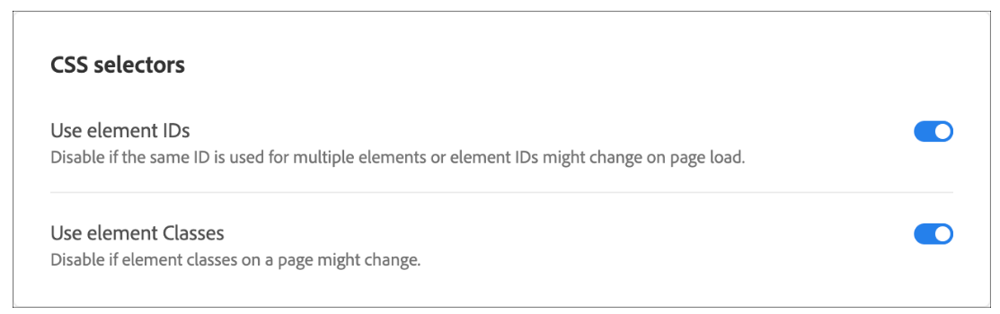

# Adobe Target: Link zum Bild kann nicht über VEC auf der Seite hinzugefügt werden

## Beschreibung {#description}

<b>Umgebung</b>
Adobe Target

<b>Problem</b>
Sie können die Aktivität möglicherweise über VEC erstellen, wo Sie einen Link zum Bild hinzufügen.
Mit der QA-URL/Inhaltsbereitstellung funktioniert der Link jedoch möglicherweise nicht.

<b>Ursache</b>
Dies kann darauf zurückzuführen sein, dass Adobe Target alle Selektoren vor dem Laden der DOM-Elemente abfragt. Da diese Bild-ID &quot;während der Ausführung&quot;erstellt wird, wird die nächste Aktion zum Anwenden des Links auf diese ID nicht ausgeführt, da der Selektor nicht gefunden wird.

## Auflösung {#resolution}

<b>Lösung</b>
Nehmen Sie in solchen Fällen die folgenden Änderungen an der Aktivität vor, in der Sie die Links des Bildes bearbeiten möchten:

1. Bearbeiten Sie die Aktivität.
2. Klicken Sie auf G<b>Ohr</b> Schaltfläche und navigieren Sie zu <b>Site-Voreinstellungen</b>.

       

3. Deaktivieren <b>Element-IDs verwenden</b> und <b>Speichern</b> es.
4. Klicken Sie auf <b>Nächste</b> und <b>Speichern</b> die Aktivität.

Dies sollte zur Lösung des Problems beitragen.
