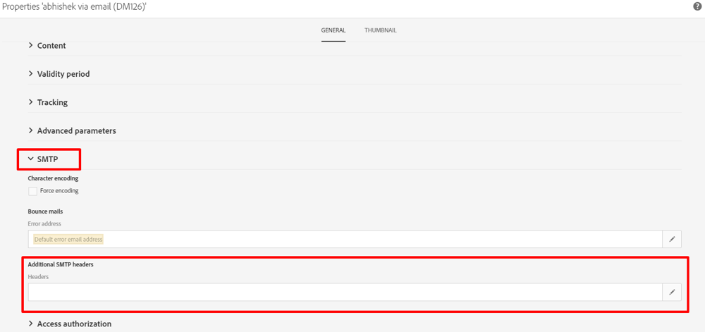

# Was ist der Header List-Unsubscribe? Und wie kann dies in ACS implementiert werden?

Dieser Artikel enthält Informationen zum List-Unsubscribe-Header und dazu, wie er in ACS implementiert werden kann.

## Beschreibung {#description}

### <b>Umgebung</b>

- Campaign
- Campaign Standard

### <b>Problem/Symptom</b>

<b>Was ist der Header List-Unsubscribe? Und wie kann dies in ACS implementiert werden?</b>

Der Header List-Unsubscribe ist ein optionaler E-Mail-Header, den Sie zu Ihren Nachrichten hinzufügen können. Abonnenten können dadurch die Schaltfläche zum Abmelden sehen, auf die sie klicken können, wenn sie automatisch keine E-Mails mehr erhalten möchten.

List-Unsubscribe wird von Gmail, Outlook.com und anderen verwendet. Es soll dazu beitragen, Beschwerden zu reduzieren, indem Abonnenten eine andere Methode angeboten wird, sich sicher abzumelden, ohne dass sich dies negativ auf die Reputation des Absenders auswirkt.

Der Header List-Unsubscribe lässt sich leicht mit zwei anderen Optionen verwechseln, mit denen Abonnenten sich von Ihrer E-Mail abmelden können.

Die Option List-Unsubscribe ist nicht verfügbar:

- Die Spam-Schaltfläche: Wenn auf die Junk- oder Spam-Schaltfläche geklickt wird, wird eine Beschwerde ausgelöst, die sich negativ auf Ihre Reputation des Versands auswirkt.
- Der Abmelde-Link im E-Mail-Creative: Dieser Link befindet sich normalerweise in der Fußzeile Ihres HTML-Creatives und wird von Ihnen gesteuert. Die List-Unsubscribe-Funktion wird jedoch vom Postfachanbieter gesteuert, wenn Sie sie in Ihre Kopfzeilen eingefügt haben.

Stellen Sie sich also die Option List-Unsubscribe als dritte Methode vor, mit der Abonnenten aus Ihrer Mailingliste entfernt werden können. Und es ist eine Option, die dazu beiträgt, Ihre Reputation zu schützen, indem Sie Ihre Beschwerden möglicherweise reduzieren.

Der E-Mail-Header List-Unsubscribe ist in RFC 2369 definiert.

<b>Was ist der Header List-Unsubscribe? </b>

`span style=Find No Results`

## Auflösung {#resolution}

<b>Implementierung in ACS:</b>

In ACS ist es nur möglich, einen SMTP-Header in die Versandvorlage hinzuzufügen (er kann nicht direkt im Versand hinzugefügt werden).

Gehen Sie wie folgt vor:

1. Öffnen und bearbeiten Sie die Eigenschaften Ihrer Versandvorlage.
2. Klicken Sie auf den Abschnitt SMTP und bearbeiten Sie die Kopfzeilen aus den zusätzlichen SMTP-Kopfzeilen.     
3. Fügen Sie die folgende Befehlszeile hinzu:    `List-Unsubscribe: <mailto:bounce@subdomain?subject=unsubscribe<%=escape(context.mimeMessageId) %>>`

Die E-Mail-Adresse<b>*bounce@subdomain</b>*steht für <b>returnPath-Adresse</b>
