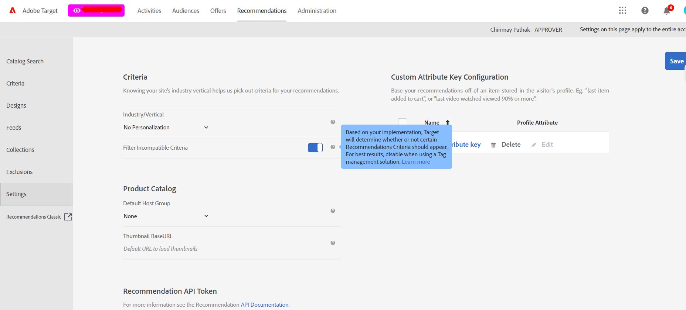

# Empfehlung: Filterkriterien beim Erstellen einer Aktivität

## Beschreibung {#description}


<b>Umgebung</b>
Adobe Target

<b>Problem</b>
Erhalten Sie eine Warnmeldung, wenn Sie ein bestimmtes Kriterium auf eine Aktivität anwenden, auch wenn alles korrekt konfiguriert ist: Die Seiten in der Aktivität übergeben die Parameter, die für die Kriterien erforderlich sind (`entity.id` und `entity.categoryId`) im Mbox-Aufruf.

Die folgende Fehlermeldung wird jedoch weiterhin angezeigt, wenn die erforderlichen Kriterien auf die Aktivität angewendet werden:


```
An entity.ategoryID is required for this criteria to work properly. Use it anyway?
```


<b>Ursache</b>
Manchmal nimmt der Aktivitäts-Builder nicht richtig auf, dass die Seite mit Tags versehen ist `entity.id` und `entity.categoryId` und zeigt weiterhin die Warnmeldung an.


## Auflösung {#resolution}


<b>Lösung</b>
Sie können die Filterung auf Kontoebene aus den Empfehlungseinstellungen wie unten gezeigt deaktivieren:




Die Bereitstellung von Aktivitätsinhalten ist mit dieser Konfiguration in keiner Weise eingeschränkt.

Diese Filterung wird nur zur Erstellung der Aktivität verwendet, würde jedoch den Algorithmus in keiner Weise beeinträchtigen.
