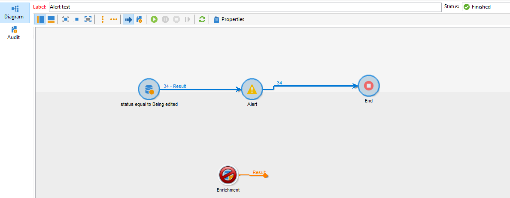

# Die Aktivität Warnung schlägt fehl, wenn die Anreicherungsaktivität nach der Abfrage in der Versandtabelle hinzugefügt wird

## Beschreibung {#description}

<b>Umgebung</b>

## Lösung {#resolution}

Um dieses Problem zu beheben, wurde NEO-25157 für FuE erstellt und das Problem wurde seitdem in Build 9330 behoben.
<b>Ursache</b>

Dies ist ein bekannter Fehler in Build 9032, durch den bei einer Abfrage eine Anreicherungsaktivität hinzugefügt wird.<b> </b>wird in der Versandtabelle über den Versandstatus ausgeführt. Ob die Anreicherung etwas bewirkt oder nicht, die Warnungsaktivität schlägt fehl

Erfolg ohne Anreicherung:

Fehlschlagen der Anreicherung:

Auditprotokolle: <b>*Versandkennung \*\*\*\*\* konnte nicht in den Cache geladen werden: ....</b>*

