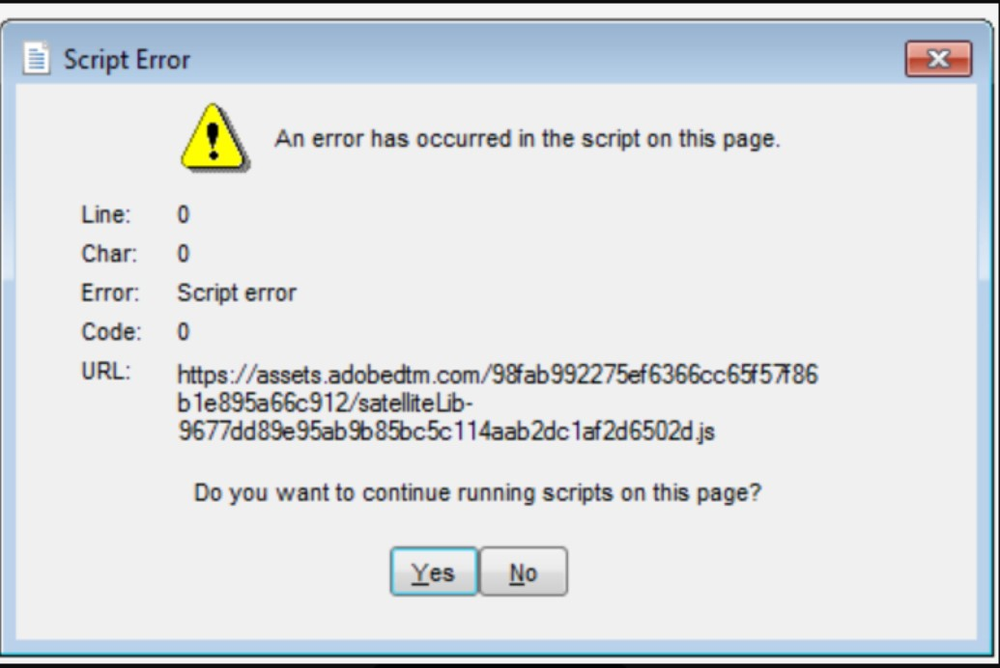

# Campaign Classic - Skriptfehler/-warnung beim Anmelden

In diesem Artikel wird das Problem behoben, bei dem Campaign Classic einen Skriptfehler bei der Anmeldung aufgibt: &quot;Mit dem Skript auf dieser Seite ist ein Fehler aufgetreten.&quot;

## Beschreibung {#description}

<b>Umgebung</b>

Campaign Classic

<b>Problem/Symptome</b>

- Campaign Classic gibt bei der Anmeldung einen Skriptfehler aus: &quot;Beim Skript auf dieser Seite ist ein Fehler aufgetreten.&quot;
- Benutzer können sich nach dem Klicken auf &quot;Nein&quot;anmelden

## Auflösung {#resolution}

<b>Auflösung/Problemumgehung</b>

Den JavaScript-Parameter maxMB erhöhen: https://experienceleague.adobe.com/docs/campaign-classic/using/installing-campaign-classic/appendices/the-server-configuration-file.html?lang=en#javascript

<b>Ursache</b>

Die standardmäßige maxMB-Parametereinstellung ist 512. Dadurch wird die maximale Größe in Megabyte festgelegt, die zulässig ist, bevor der Garbage Collector ausgeführt wird. Gelegentlich ist diese Einstellung unzureichend, was zu Skriptfehlern führt, die durch eine Erhöhung der Speicherzuweisung korrigiert werden können.
