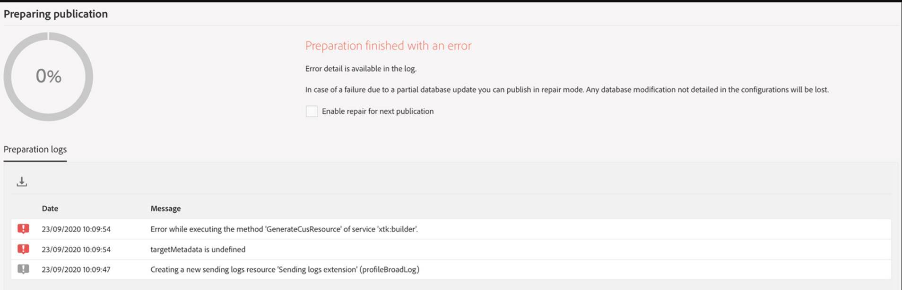

# [Kampagne] Fehler beim Importieren eines Pakets aus dem Staging

## Beschreibung {#description}

<b>Umgebung</b>
- Package-Import aus der Staging- in die Produktionsumgebung
- Das Paket enthält neue benutzerdefinierte Ressourcen

<b>Symptome</b>
- Import schlägt fehl mit Fehler: Vorbereitung abgeschlossen mit Fehler

## Auflösung {#resolution}

Schritte zum Auflösen/Beheben
- Package ohne Entität &quot;Versandlogs&quot;erneut exportieren
- Importieren Sie das neue Paket

<b>Ursache</b>
- Die Entität Versandlogs muss nicht exportiert werden. Sie wird bei der Veröffentlichung des Profils neu erstellt.

