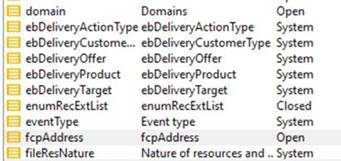

# Emoticon-Auflistungen

## Beschreibung

<b>Umgebung</b>
- Campaign Classic
- Campaign
- Campaign Standard

<b>Problem/Symptome</b>
Gemäß [following](https://experienceleague.adobe.com/docs/campaign-classic/using/sending-messages/personalizing-deliveries/customizing-emoticon-list.html?lang=en#add-new-emoticon) -Dokument, können wir eine OOTB-Emoticon-Liste unter Auflistungen haben.
[https://experienceleague.adobe.com/docs/campaign-classic/using/sending-messages/personalizing-deliveries/customizing-emoticon-list.html?lang=en#add-new-emoticon](https://experienceleague.adobe.com/docs/campaign-classic/using/sending-messages/personalizing-deliveries/customizing-emoticon-list.html?lang=en#add-new-emoticon)

Der Benutzer sieht diese Liste jedoch nicht. Gibt es ein Paket, das installiert werden muss oder etwas Anderes, das konfiguriert werden muss?

## Auflösung

Dies war eine neue Funktion, die 1978 eingeführt wurde. Sehen Sie sich die [Versionshinweise](https://experienceleague.adobe.com/docs/campaign-classic/using/release-notes/previous-releases/release--20-2.html?lang=en#release-20-2-1-build-9178) in der Experience League-Dokumentation für weitere Informationen.

Beachten Sie, dass der Benutzer dieselbe Konsolenversion wie der Server-Build verwenden muss, um das Menü &quot;Emoticons&quot;anzuzeigen.
