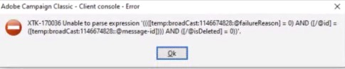

# Fehler wird bei der Vorschau eines Profils aus einem Versand erzeugt | ACC

Wenn eine Fehlermeldung angezeigt wird *Der Ausdruck kann nicht analysiert werden.* während der Vorschau eines Profils in <b>Adobe Campaign Classic</b> durch Auswahl der <b>Zielpopulation für Sendungen</b> in der Vorschau eines Versands angezeigt wird, können Sie den Anweisungen in diesem Artikel folgen, um das Problem zu beheben.

## Beschreibung {#description}

### <b>Umgebung</b>

Adobe Campaign Classic

### <b>Probleme/Symptome</b>

Bei der Vorschau eines Profils wurde ein Problem gemeldet, indem die<b>Zielpopulation für Sendungen</b>&quot; in der Vorschau eines Versands angezeigt. Der generierte Fehler wird im Folgenden beschrieben:

## Auflösung {#resolution}

Das Problem besteht in der Verwendung eines Zielgruppen-Mappings, das auf einem erweiterten Empfängerschema basiert und bei dem das Versandlog und die Trackinglog-Schemata nicht für dasselbe Schema erweitert wurden. Ein Zielgruppen-Mapping muss im Vergleich zu Versandlog-/Trackinglog-Schemata eindeutig sein.

Es ist nicht möglich, mehrere Targeting-Schemas mit demselben `trackinglog` -Schema, da der Tracking-Workflow keine Daten mit der Zielgruppen-ID abstimmen kann.

Falls der Kunde `OOB` Zielgruppen-Mapping (mit `nms:recipient`), empfehlen wir zwei Vorgehensweisen:

- Wenn Sie eine benutzerdefinierte Zielgruppendimension verwenden möchten, müssen Sie eine benutzerdefinierte `broadLog/trackingLog` Schemata, die `nms:broadlog` als Vorlage (c.f. `nms:broadLogRcp, nms:broadLogSvc,` usw.)

   - Zielgruppenschema: `cus:recipient` (erweitert von `nms:recipient` oder vollständig benutzerdefiniert)
   - Broadcast-Protokollschema: `cus:broadLogRcp` (erweitert von `nms:broadLogRcp` oder vollständig benutzerdefiniert)
   - Trackinglog-Schema: `cus:trackingLogRcp` (erweitert von `nms:broadLogRcp` oder vollständig benutzerdefiniert)
- Wenn Sie `OOB trackingLogRcp/broadLogRcp`muss die Zielgruppendimension `nms:recipient` und die Filterdimension ein benutzerdefiniertes Schema sein könnte

