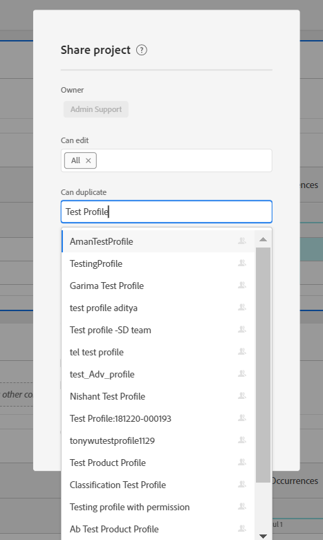

# Voraussetzung, um ein Produktprofil verfügbar zu machen, während Sie ein Workspace-Projekt freigeben

## Beschreibung {#description}

<b>Umgebung</b>
- Customer Journey Analytics
- Analysen

<b>Probleme/Symptome</b>
Ein Produktprofil, das &quot;X&quot;angibt, ist möglicherweise nicht in der Dropdown-Liste verfügbar, während ein Workspace-Projekt für Benutzer von &quot;X&quot;freigegeben wird.

## Lösung {#resolution}

Damit ein Produktprofil in der Dropdown-Liste verfügbar wird, während es ein Workspace-Projekt teilt, muss es über eine Analytics-Berechtigung verfügen/über eine entsprechende Berechtigung in Admin Console verfügen. Sobald dem Produktprofil &quot;X&quot;eine zufällige Berechtigung hinzugefügt wurde, sollte der Benutzer diese in der Dropdown-Liste sehen, während er ein beliebiges Workspace-Projekt freigibt.

Im obigen Beispiel war das Produktprofil &quot;Testprofil X&quot;nicht in der Dropdown-Option verfügbar, wenn es neu ohne Berechtigungen erstellt wurde. Als wir jedoch Berechtigungen hinzugefügt haben, wurde sie verfügbar.

<b>Hinweis:</b> Wenn alle dem Produktprofil &quot;X&quot;zugewiesenen Berechtigungen in Admin Console widerrufen werden, würde das Produktprofil &quot;X&quot;das <b>still </b>weiterhin in der Dropdown-Liste für die Projektfreigabe verfügbar sein.

     
