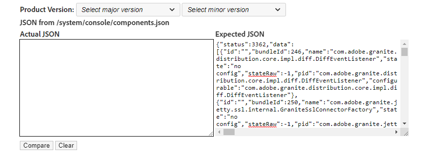
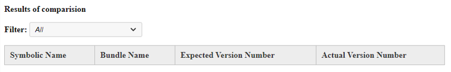

# Experience Manager - Wie validiert man die OSGi-Bundle-Version nach Updates?

## Beschreibung {#description}

<b>Umgebung</b>
Adobe Experience Manager

<b>Problem/Symptome</b>
Wie kann ich die OSGi-Bundle-Version nach einem Update überprüfen, um eine erfolgreiche Installation zu bestätigen?

## Auflösung {#resolution}

<b>Schritte zum Auflösen</b>
1. JSON kopieren/einfügen aus <b>*http://aemhost1:port/*system/console/bundles.json</b> der <b>Tatsächliche JSON</b> Textfeld.
2. Auswählen <b>Produktversion</b> von *Hauptversion* und *Nebenversion* Dropdown-Menüs zum automatischen Ausfüllen der <b>Erwartete JSON</b> oder kopieren/einfügen Sie JSON aus einer anderen AEM-Instanz in die <b>Erwartete JSON</b> -Feld (auch von <b>*http://aemhost2:port/*system/console/bundles.json</b>).
3. Klicken <b>Vergleichen</b> um den Vergleich anzuzeigen.\
   

<b>Ergebnisse des Vergleichs</b>

1. *Ähnlich* Bundles werden in Weiß angezeigt, *Unterscheiden* Bundle-Versionen werden gelb angezeigt, *Neu hinzugefügt* Bundles werden in Aqua angezeigt und *Gelöscht* Bundles in hellrot.
2. Filtern Sie die Daten mithilfe der <b>Filter</b> ankreuzen.\
   

\* Dank [Sham Sundar Hassan Chikkegowda](https://www.linkedin.com/in/sham-sundar-hassan-chikkegowda-6b03a517) zur Bereitstellung des Originals [Quellcode](https://github.com/Schikkeg/schikkeg.github.io/blob/master/tools/coi.html) für dieses Tool. Seine persönliche Website kann besucht werden [here](https://www.aemstuff.com/).
