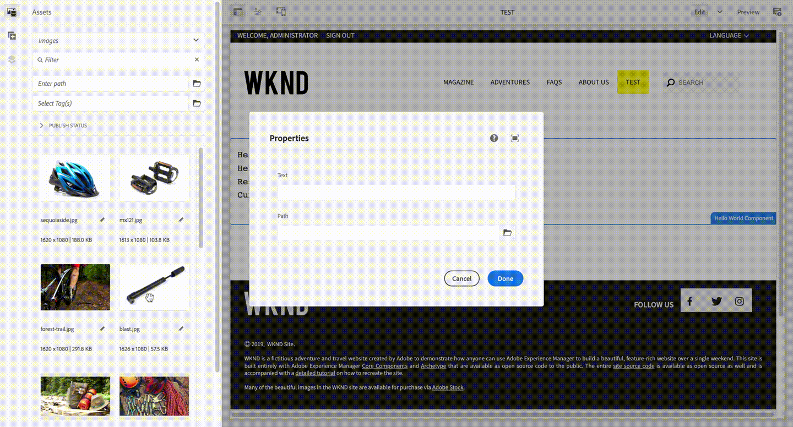

# So aktivieren Sie das Ziehen und Ablegen einer Asset-Funktion in ein PathField

## Beschreibung {#description}


<b>Umgebung</b>

Adobe Experience Manager

<b>Problem/Symptome</b>

Ab AEM 6.5.10 können Sie ein Asset aus dem Asset-Browser in ein PathField-Element im Seiteneditor ziehen. Diese Funktion entspricht der folgenden Zeile in AEM 6.5.10-Versionshinweisen (https://experienceleague.adobe.com/docs/experience-manager-65/release-notes/service-pack/6.5.10.html):

&quot;PathField im Sites-Editor ermöglicht es Autoren, Assets aus der Inhaltssuche zu ziehen.&quot;

In diesem Artikel wird erläutert, wie man diese Funktion aktiviert.




## Auflösung {#resolution}


Fügen Sie die Eigenschaft &quot;dropped&quot;zum Knoten von PathField hinzu.


```
name: droppable

  type: Boolean

  value: true
```


<b>Anpassungsbeispiel:</b>

Ein PathField mit `droppable=true`wurde zur Komponente &quot;HelloWorld&quot;des WKND-Tutorials hinzugefügt, z. B.

`/apps/wknd/components/helloworld/cq:dialog/content/items/column/items/path:`


```
?xml version="1.0" encoding="UTF-8"?
    jcr:root xmlns:sling="http://sling.apache.org/jcr/sling/1.0" xmlns:cq="http://www.day.com/jcr/cq/1.0" xmlns:jcr="http://www.jcp.org/jcr/1.0" xmlns:nt="http://www.jcp.org/jcr/nt/1.0"
        jcr:primaryType="nt:unstructured"
        jcr:title="Properties"
        sling:resourceType="cq/gui/components/authoring/dialog"
        content
            jcr:primaryType="nt:unstructured"
            sling:resourceType="granite/ui/components/coral/foundation/fixedcolumns"
            items jcr:primaryType="nt:unstructured"
                column
                    jcr:primaryType="nt:unstructured"
                    sling:resourceType="granite/ui/components/coral/foundation/container"
                    items jcr:primaryType="nt:unstructured"
                        text
                            jcr:primaryType="nt:unstructured"
                            sling:resourceType="granite/ui/components/coral/foundation/form/textfield"
                            fieldLabel="Text"
                            name="./text"/
                        path
                            jcr:primaryType="nt:unstructured"
                            sling:resourceType="granite/ui/components/coral/foundation/form/pathfield"
                            fieldLabel="Path"
                            droppable="{Boolean}true"
                            name="./path"/
                    /items
                /column
            /items
        /content
    /jcr:root
```
