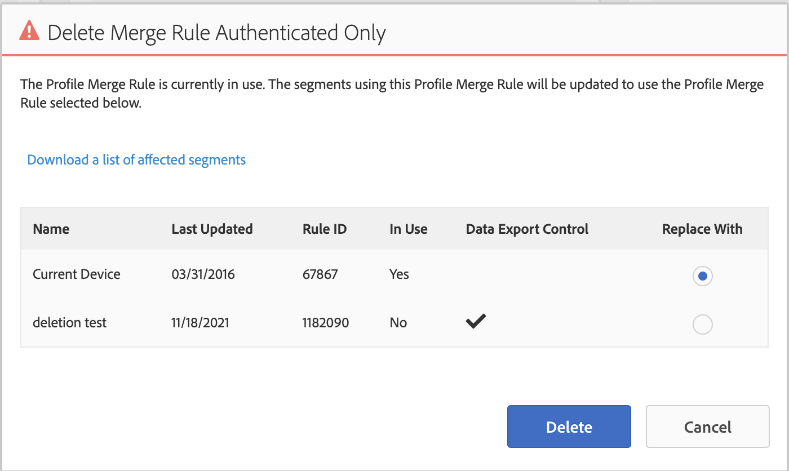

# Aufhebung der Gerätekooperation

In diesem Artikel werden die Auswirkungen und erforderlichen Schritte für die Einstellung der Gerätekooperation beschrieben.

## Beschreibung {#description}

Ab dem 31. August 2022 wird die Gerätekooperation offiziell eingestellt. In diesem Artikel werden die Auswirkungen und erforderlichen Schritte für Kunden beschrieben. 

## Lösung {#resolution}

Die Arbeit zur Einstellung der Gerätekooperation beginnt am 31. August 2022. Auch wenn die Option zur Auswahl der Co-op-Funktion zunächst nicht aus der Benutzeroberfläche entfernt werden kann, wird das Co-op-Gerätediagramm selbst entfernt. Daher kann es bei allen Segmentpopulationen, die die Co-op verwenden, zu einer deutlichen Verringerung der Größe kommen. Wir empfehlen allen Kunden, ihre Profilzusammenführungsregeln (PMRs) vor dem 31. August 2022 zu aktualisieren.

Um PMRs zu aktualisieren, navigieren Sie zu Zielgruppendaten `>`  Profilzusammenführungsrichtlinien und wählen Sie die betreffende Regel aus. Rechts unten auf der PMR-Übersichtsseite können Sie Ihre Geräteoptionen aktualisieren:

Wählen Sie &quot;Profil-Link-Gerätediagramm&quot;oder &quot;Geräteprofil&quot;, um Ihre PMR zu aktualisieren. Weitere Informationen zu den Unterschieden zwischen diesen beiden Optionen finden Sie hier: [https://experienceleague.adobe.com/docs/audience-manager/user-guide/features/profile-merge-rules/merge-rule-definitions.html?lang=en#device-options](https://experienceleague.adobe.com/docs/audience-manager/user-guide/features/profile-merge-rules/merge-rule-definitions.html?lang=en#device-options)

Wenn Sie bei dem Versuch, Ihre PMR zu aktualisieren, auf Probleme oder Konflikte stoßen, liegt dies höchstwahrscheinlich an den angehängten Segmenten und den zugehörigen Datenexportkontrollen. In diesem Fall empfehlen wir die Erstellung einer neuen PMR (wenden Sie sich an die Kundenunterstützung, um eine neue Regel zu erstellen, wenn Sie die Grenze erreichen): [https://experienceleague.adobe.com/docs/audience-manager/user-guide/features/profile-merge-rules/merge-rules-start.html?lang=en#profile-merge-rule-setup](https://experienceleague.adobe.com/docs/audience-manager/user-guide/features/profile-merge-rules/merge-rules-start.html?lang=en#profile-merge-rule-setup)

Wenn Ihre alte gemeinsame PMR nicht mehr verwendet wird, können Sie die Regel löschen. Wählen Sie Ihre neu erstellte PMR aus dem vorherigen Schritt aus, wenn Sie die Option erhalten:

Als Alternative bietet die [BAAAM-Tool](https://experienceleague.adobe.com/docs/audience-manager/user-guide/reference/bulk-management-tools/bulk-management-intro.html?lang=en) Sie können auch alle relevanten Segmente von der alten gemeinsamen PMR-Regel auf Ihre neu erstellte Regel aktualisieren: [https://experienceleague.adobe.com/docs/audience-manager/user-guide/reference/bulk-management-tools/bulk-management-intro.html?lang=en#actions-ops](https://experienceleague.adobe.com/docs/audience-manager/user-guide/reference/bulk-management-tools/bulk-management-intro.html?lang=en#actions-ops)

Von einem Dienst erstellte Segmente, z. B. Cloud-basierte Zielgruppen für Vorhersagen und Erlebnisse (über Analytics freigegeben), können nicht direkt in der Benutzeroberfläche oder über API bearbeitet werden. Wenn beim Versuch, Ihre PMR zu löschen und die Segmente zu verschieben, ein Fehler auftritt oder Probleme mit einzelnen Segmenten innerhalb des BAAAM-Tools auftreten, kompilieren Sie bitte eine Liste problematischer Segment-IDs und öffnen Sie ein Ticket bei der Kundenunterstützung. 

Wenn Sie nach der oben beschriebenen Aktualisierung Ihrer Regeln die Co-op-Option aus Ihrer Benutzeroberfläche entfernen möchten, öffnen Sie ein Ticket für die Kundenunterstützung, in dem Sie die Entfernung der Gerätekooperation anfordern. Sie können auch ein Ticket mit allgemeinen Fragen oder Bedenken zu diesem Artikel oder der allgemeinen Einstellung der Gerätekooperation öffnen.

Weitere Informationen finden Sie in den häufig gestellten Fragen . [https://experienceleague.adobe.com/docs/device-co-op/using/about/device-co-op-eol.html?lang=en](https://experienceleague.adobe.com/docs/device-co-op/using/about/device-co-op-eol.html?lang=en)
