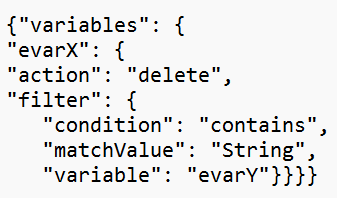

# Datenreparatur-API: Wie kann nach einer anderen Variablen als der Zielvariablen gefiltert werden?

## Beschreibung {#description}

Zusammengesetzte Filter können in der Data Repair API verwendet werden. Löschen Sie beispielsweise evar3, wenn evar2=X ist.
  

## Auflösung {#resolution}

Die Datenreparatur-API ermöglicht das Filtern von Variablen, die nicht zur Zielvariablen gehören. Dies ist nicht für alle Kunden verfügbar. Weitere Informationen erhalten Sie bei der Kundenunterstützung von Adobe.   <u><b>Syntax</b></u>:

<u><b>Hinweis</b></u>: Wenn ein Fehler im Zusammenhang mit der Syntax der Textkörpervariablen erkannt wird, fügen Sie den Inhaltstyp hinzu: -Kopfzeilenparameter &quot;application/json&quot;zur API-Anfrage hinzufügen.