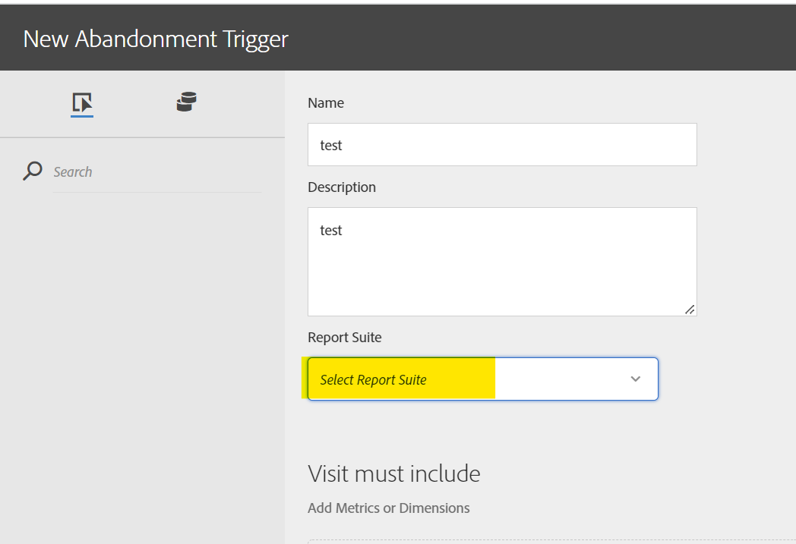

# Report Suite-IDs, die in der Trigger-Benutzeroberfläche nicht im Dropdown-Menü verfügbar sind

## Beschreibung {#description}

<b>Umgebung</b> Analytics   <b>Problem/Symptom</b> Was kann der mögliche Grund dafür sein, dass die Report Suite-ID nicht in der Dropdown-Liste der Experience Cloud Trigger-Benutzeroberfläche aufgefüllt wird?

## Auflösung {#resolution}

Dies geschieht, wenn die Report Suite nicht der Experience Cloud-Org zugeordnet ist. Weitere Informationen erhalten Sie bei der Adobe-Kundenunterstützung.

 
