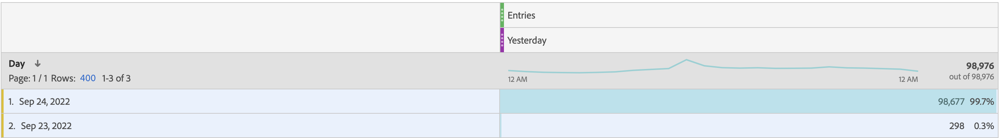
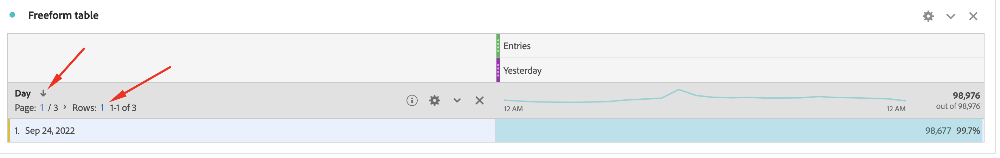

# Einstiege: Terminierter Bericht zu Metriken umfasst außerhalb des Berichtsfensters

## Beschreibung

<b>Problem:
  </b>
 Der Bericht zu geplanten Einstiegsmetriken enthält Daten, die außerhalb des Berichtsfensters liegen.
 Wie unten dargestellt, ist das Berichtsfenster &quot;Gestern&quot;, aber der geplante Bericht enthielt nicht nur die Daten von gestern (24. September), sondern auch die Daten anderer Tage.
 Was ist der Grund und wie werden nur die gestrigen Daten in den terminierten Bericht aufgenommen?
  
  
 

## Auflösung

<b>Grund:</b>
Da Einträge besuchsbasierte Metriken sind.
Besuchsbasierte Metriken wie Einträge und Absprungrate können Daten einem Tag vor dem Startdatumsbereich des Berichtsfensters zuordnen. Das häufigste Szenario dieser Attribution ist, wenn Besuche über Mitternacht hinausgehen. Beispiel:

1. Ein Benutzer hat Ihre Homepage am 23. September um 23:50 Uhr besucht.
2. Nach dem Besuch mehrerer Seiten verließ der Benutzer Ihre Homepage um 24:10 Uhr.

Wenn in diesem Beispiel das &quot;Berichtsfenster&quot;der 24. September (gestern) ist, wird dieser Besuch in den Bericht aufgenommen. 
Da die Einstiegsmetriken jedoch dem 23. September zugeordnet sind, wird auch der &quot;23. September 2022&quot;der Day-Dimension im Bericht angezeigt.
 
<b>Lösung:</b>
Es ist &quot;Work As Design&quot;. Als Problemumgehung können Sie jedoch die Zeilennummer auf 1 festlegen, die Dimension &quot;Day&quot;in anständiger Reihenfolge sortieren, den Bericht dann speichern und neu planen. Sie können einen Bericht erhalten, der nur &quot;Gestern&quot;-Daten enthält, wie unten dargestellt.
 

