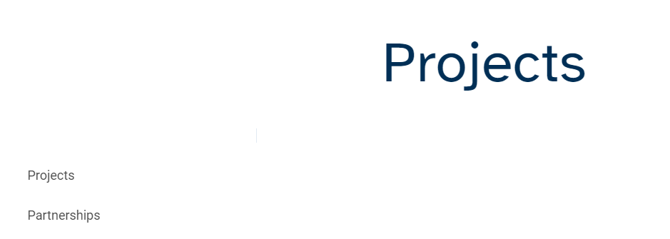

# Replikationsproblem

## Beschreibung

Ein Kunde hatte das folgende Problem: Ihre Website hatte zwei Sprachzweige - Italienisch (es) und Englisch (en) - mit demselben Inhalt, die englische Zweigstelle ist eine Live Copy der italienischen.

Die Engländer &quot;*Projekte*&quot; hatte die Seite den Namen &quot;*progetti*&quot;, aber auch ein Alias auf &quot;*Projekte*&quot;, hätte es sowohl unter http://Publisher.URL/content/htlab/en/progetti.html als auch unter http://Publisher.URL/content/htlab/en/projects.html verfügbar sein müssen.
Nur bei Zugriff über &quot;*progetti*&quot;Die richtigen untergeordneten Elemente wurden als barrierefreie Links auf der Seite angezeigt - &quot;*Projekte*&quot; und &quot;*Partnerschaften*&quot;.

Wann immer der Zugriff über &quot;*Projekte*&quot; die angezeigten Kinder &quot;*Projekte* und eine falsche Seite &quot;*Partnerschaften*&quot;, obwohl diese Seite im Autor nicht vorhanden war.

## Auflösung

Es wurde festgestellt, dass im Repository des Herausgebers neben dem korrekten &quot;*progetti*&quot; gibt es auch eine Seite mit dem Namen &quot;*Projekte*&quot;, die die falsche Seite enthält &quot;*Partnerschaften*&quot;als Kind.
Vielleicht wurde es irgendwann erstellt und dann gelöscht, ohne dass es veröffentlicht wurde, und es wurde auch zwischengespeichert.
Das Problem wurde behoben, nachdem das gesamte*Projekte*&quot;Seite unter &quot;en&quot;und folgen Sie den Schritten:

1. Erstellen Sie eine Live Copy des Italienischen &quot;*progetti*&quot;Seite ohne die untergeordneten Elemente und mit den Eigenschaften: Name: Projekte; title: Projekte
2. Erstellen Sie Live Copies für die untergeordneten Elemente der &quot;*progetti*&quot;Seite wie unten:              - für &quot;*progetti*&quot;, erstellen Sie eine Live Copy mit dem Namen &quot;Projekte&quot;und dem Titel &quot;Projekte&quot;- für &quot;*Partnerschaften*&quot;Erstellen Sie eine Live Copy mit dem Namen &quot;Partnerschaft&quot;und dem Titel &quot;Partnerschaft&quot;.
3. Neu erstellte Seiten veröffentlichen
4. Veröffentlichung der Seiten rückgängig machen
5. Löschen Sie das gesamte &quot;p *Projekte*&quot; erneut.

Auf diese Weise wird die *Projekte*&quot;wurde auch aus dem Repository des Herausgebers zusammen mit der falschen gelöscht. &quot;*Partnerschaften*&quot; ein.
