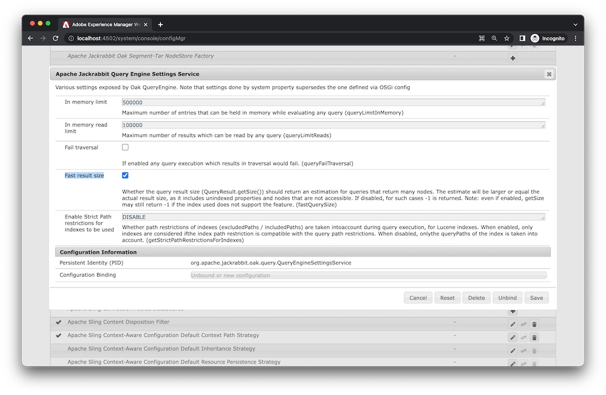
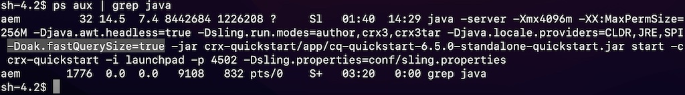
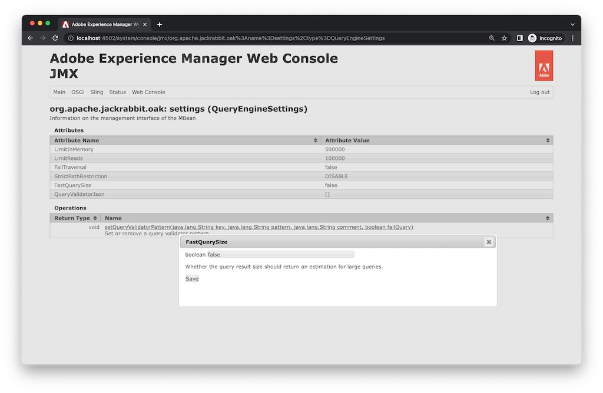

# Adobe Experience Manager: Überprüfen von Konfigurationen, wenn die Anzahl der Treffer falsch erscheint

## Beschreibung

Wenn sich die tatsächliche Anzahl der Suchergebnisse von der Anzahl der Treffer für eine Abfrage unterscheidet, kann die fastQuerySize-Option als aktiviert (true) eingestellt werden.
 Es gibt mehrere Möglichkeiten, die fastQuerySize-Option zu aktivieren. In diesem Artikel wird beschrieben, wie Sie die einzelnen Methoden konfigurieren.
  

## Lösung

<b>OSGi-Konfiguration</b>:Web-Konsole > Konfiguration > Apache Jackrabbit Query Engine Settings Service > Schnelle Ergebnisgröße

http://localhost:4502/system/console/configMgr/org.apache.jackrabbit.oak.query.QueryEngineSettingsService Überprüfen Sie &quot;Schnelle Ergebnisgröße&quot;und &quot;Speichern&quot;.
   

<b>Java-Konfiguration</b>:-Doak.fastQuerySize=true

Fügen Sie die Systemeigenschaft unten in Ihrem AEM-Startskript hinzu (crx-quickstart/bin/start).
        CQ_JVM_OPTS=&quot;${CQ_JVM_OPTS} -Doak.fastQuerySize=true&quot;

Diese Konfiguration überschreibt die OSGi-Konfiguration.
    

<b>JMX</b>:Web-Konsole > JMX > org.apache.jackrabbit.oak: settings (QueryEngineSettings)

http://localhost:4502/system/console/jmx/org.apache.jackrabbit.oak%3Aname%3Dsettings%2Ctype%3DQueryEngineSettings Ändern Sie &quot;Schnelle Ergebnisgröße&quot;in &quot;true&quot;und &quot;Speichern&quot;.

Dieser Konfigurationswert bei JMX überschreibt andere Konfigurationen. Beim Neustart AEM der Wert zurückgesetzt.

