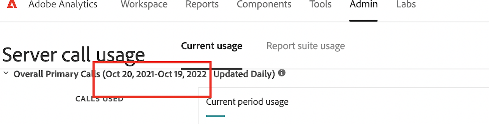

# Der Datumszeitraum in der Benutzeroberfläche zur Nutzung von Server-Aufrufen und der Vertrag sind für die Adobe Analytics nicht zutreffend.

## Beschreibung {#description}

 Der Datumszeitraum in der Benutzeroberfläche zur Nutzung der Server-Aufrufe und das Datum im Vertrag stimmen nicht überein. Warum?  
 Im Adobe Analytics-Vertrag beispielsweise ist der Datumszeitraum 20/Okt/2021 ~ 19/Januar/2023.  
 In der Benutzeroberfläche zur Nutzung der Server-Aufrufe ist der Datumsbereich jedoch 20/Okt/2021 ~ 19/Okt/2022.         

## Lösung {#resolution}

Es funktioniert wie geplant.
Der Datumszeitraum in der Benutzeroberfläche zur Nutzung von Server-Aufrufen hängt von den Commit-Zyklusmonaten ab und nicht vom Start-/Enddatum des Diensts.
Für den obigen Kunden werden die Monate des Commitzyklus in 12-monatigen Zeitabständen berechnet.
Wenn dieser Commit-Zyklus am 19.10.2022 endet, wird ihr nächster Commit-Zyklus 3 Monate betragen und am 19.01.2023 enden.
