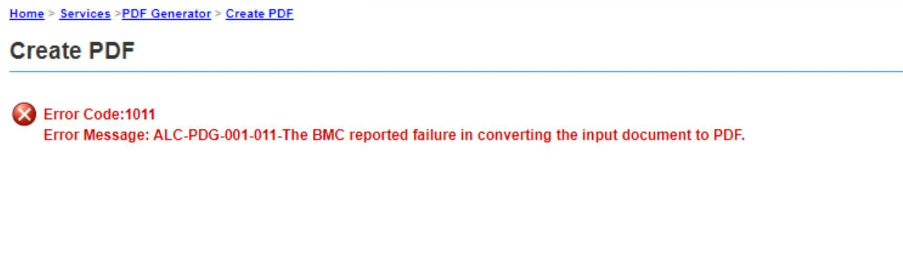

# Adobe Experience Manager Forms: Wie Sie den PDF-Generator-Fehler mit JPEG 2000 beheben

## Beschreibung {#description}


PDF Generator kann Assets im JPEG 2000-Format (JPF, JPX, JP2, J2K, J2C, JPC) auf einem Windows-Server mit Acrobat 2020 Classic nicht verarbeiten und zeigt den folgenden Fehler an.


```
Error Code:1011 
Error Message: ALC-PDG-001-011-The BMC reported failure in converting the input document to PDF.
```


Dieser Artikel beschreibt, wie Sie dieses Problem beheben können.

Beispielprotokolle:
server.log


```
01:23:45,678 ERROR com.adobe.aes.web.create.CreatePDFAct (default task-15) ALC-PDG-001-000-Invocation error.: ALC-DSC-003-000: com.adobe.idp.dsc.DSCInvocationException: Invocation error.
    at com.adobe.idp.dsc.component.impl.DefaultPOJOInvokerImpl.invoke(DefaultPOJOInvokerImpl.java:152) adobe-dscf-client.jar:6.5.0.0.20220523.bee76832
    at.
...
Caused by: ALC-PDG-1011-000: com.adobe.livecycle.generatepdf.client.ConversionException: ALC-PDG-001-011-The BMC reported failure in converting the input document to PDF.
    at com.adobe.pdfg.BMCCaller.checkResult(BMCCaller.java:405)
    at com.adobe.pdfg.Native2PdfCaller.callNativeBMC(Native2PdfCaller.java:1229)
    at com.adobe.pdfg.Native2PdfCaller.createPDF(Native2PdfCaller.java:420)
    at com.adobe.pdfg.GeneratePDFImpl.createPDFInternal(GeneratePDFImpl.java:527)
    at com.adobe.pdfg.GeneratePDFImpl.createPDFCommon(GeneratePDFImpl.java:366)
    at com.adobe.pdfg.GeneratePDFImpl.createPDF(GeneratePDFImpl.java:307)
    at sun.reflect.NativeMethodAccessorImpl.invoke0(Native Method) rt.jar:1.8.0_181
    at sun.reflect.NativeMethodAccessorImpl.invoke(NativeMethodAccessorImpl.java:62) rt.jar:1.8.0_181
    at sun.reflect.DelegatingMethodAccessorImpl.invoke(DelegatingMethodAccessorImpl.java:43) rt.jar:1.8.0_181
    at java.lang.reflect.Method.invoke(Method.java:498) rt.jar:1.8.0_181
    at com.adobe.idp.dsc.component.impl.DefaultPOJOInvokerImpl.invoke(DefaultPOJOInvokerImpl.java:118) adobe-dscf-client.jar:6.5.0.0.20220523.bee76832
    ... 207 more
```




<b>Umgebungen</b>

AEM 6.5 Forms auf JEE
Acrobat 2020 Classic
Microsoft Windows Server 2019


## Auflösung {#resolution}


Legen Sie einen Registrierungseintrag für Acrobat fest.

1. Öffnen Sie den Registrierungs-Editor auf dem Windows-Server, auf dem AEM Forms ausgeführt wird

2. Wählen Sie den folgenden Pfad aus
HKEY_CURRENT_USER\SOFTWARE\Adobe\Adobe Acrobat\DC\ImageConversionPlugin

3. Erstellen Sie einen neuen Schlüssel (wenn buseSandbox existiert, ändern Sie nur die Daten)

Name: buseSandbox
Typ: REG_DWORD (32 Bit) Wert
Daten: 0

Führen Sie „PDF erstellen“ von PDF Generator erneut aus und überprüfen Sie, ob die PDF-Generierung jetzt erfolgreich ist.
