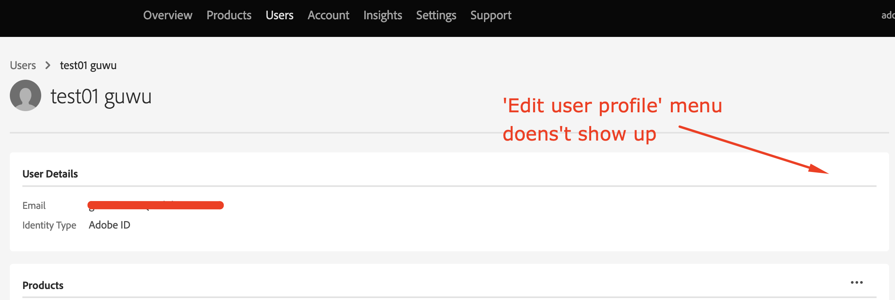

# Aktualisieren des Benutzer-ID-Namens in der Admin Console

Dieser Artikel enthält Informationen zum Aktualisieren des Benutzer-ID-Namens in der Adobe Admin Console.

## Beschreibung {#description}

### <b>Umgebung</b>

Analysen

### Problem/Symptome

Benutzer-ID (Federated ID, Enterprise ID oder Adobe ID) hat die Systemadministratorberechtigung, die <b>Benutzerprofil bearbeiten</b> -Menü der Benutzer-ID in der Admin Console nicht angezeigt. Aktualisieren des Benutzer-ID-Namens, `test01 guwu` in der folgenden Abbildung? 

## Auflösung {#resolution}

ID-Typ: Federated ID oder Enterprise ID oder Adobe
Bitten Sie eine andere Systemadministrierende bzw. einen anderen Systemadministrierenden in Ihrem Unternehmen, Ihr ID-Profil zu aktualisieren. Andere Systemadministrierende können über die Admin Console auf die Option <b>Benutzerprofil bearbeiten</b> Ihrer Benutzer-ID zugreifen.

ID-Typ: Business ID
Die Option <b>Benutzerprofil bearbeiten</b> ist für Benutzende vom Typ <b>Business ID</b> nicht verfügbar. Das bedeutet, dass diese Benutzer ihre Profile [hier](https://account.adobe.com/profile) aktualisieren müssen. Weitere Informationen finden Sie unter [Aktualisieren Ihres Kontoprofils](https://helpx.adobe.com/de/manage-account/using/edit-adobe-account-personal-profile.html).
 
Referenz: Weitere Informationen finden Sie unter dem Link - [Benutzer einzeln verwalten](https://helpx.adobe.com/de/enterprise/using/manage-users-individually.html)
