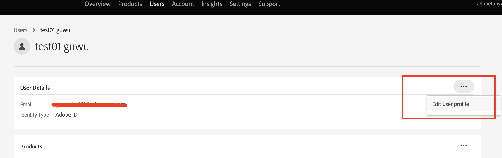

# Wie wird der Benutzer-ID-Name in der Admin Console aktualisiert?

## Beschreibung {#description}

<b>Umgebung</b> Analytics   <b>Problem/Symptome</b> Benutzer-ID (Federated ID, Enterprise ID oder Adobe ID) hat die Systemadministratorberechtigung, die <b>Benutzerprofil bearbeiten</b> -Menü der Benutzer-ID in der Admin Console. Aktualisieren des Benutzer-ID-Namens, `test01 guwu` in der folgenden Abbildung? 
  

## Auflösung {#resolution}

ID-Typ: Federated ID, Enterprise ID oder Adobe Bitten Sie einen anderen Systemadministrator in Ihrem Unternehmen, Ihr ID-Profil zu aktualisieren. Andere Systemadministratoren können auf die <b>Benutzerprofil bearbeiten</b> Ihrer Benutzer-ID über die Admin Console hinzufügen.

ID-Typ: Geschäftskennung <b>Benutzerprofil bearbeiten</b> ist nicht verfügbar für <b>Business ID </b>Benutzer. Das bedeutet, dass diese Benutzer ihre Profile [hier](https://account.adobe.com/profile) aktualisieren müssen. Weitere Informationen finden Sie unter [Aktualisieren Ihres Kontoprofils](https://helpx.adobe.com/de/manage-account/using/edit-adobe-account-personal-profile.html).
 
Referenz:
[https://helpx.adobe.com/de/enterprise/using/manage-users-individually.html](https://helpx.adobe.com/de/enterprise/using/manage-users-individually.html)
