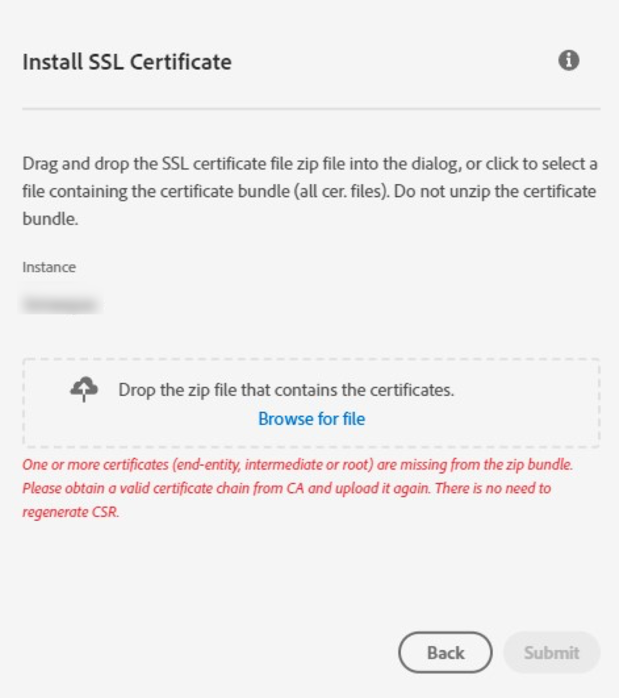

# Adobe Campaign-Zertifikate fehlen im ZIP-Bundle

## Beschreibung {#description}

<b>Umgebung</b>
    
Adobe Campaign
<b>Problem/Symptome</b>
    
Ihre SSL-Zertifikate sind abgelaufen oder laufen für einige Domänen fast ab. Wenn Sie jedoch versuchen, ein SSL-Zertifikat für die über das Control Panel für Ihr Unternehmen generierte Certificate Signing Request (CSR) hochzuladen, tritt der folgende Fehler auf: *Ein oder mehrere Zertifikate (Endentität, Zwischen- oder Stammverzeichnis) fehlen im ZIP-Bundle. Bitte rufen Sie eine gültige Zertifikatskette von der Zertifizierungsstelle ab und laden Sie sie erneut hoch. CSR muss nicht neu generiert werden*.

## Lösung {#resolution}

Ohne die vollständige Kette vertrauenswürdiger Zertifikate können SSL-Zertifikate nicht erneuert werden. Bitten Sie die Zertifizierungsstelle (Certificate Authority, CA), das ZIP-Bundle bereitzustellen, das alle Zertifikate enthält. Außerdem können Sie die Zertifikate über das Control Panel hochladen.  Wenn dies jedoch dringend erforderlich ist (Zeit, Sendungen und Kampagnenversand sind betroffen), führen Sie die folgenden Schritte aus, um &#x200B; &#x200B; &#x200B; das fehlende Zwischenzertifikat aus dem Hauptzertifikat abzurufen:

1. Wechseln Sie zu den Eigenschaften des Zertifikats, navigieren Sie zum Pfad im Zertifikat und wählen Sie das Signaturzertifikat aus.
2. Danach sollten Sie das Zwischenzertifikat mithilfe der <b>In Datei kopieren</b> -Option.
3. Nachdem das fehlende Zertifikat heruntergeladen wurde, speichern Sie das Zertifikat im vorhandenen Bundle und versuchen Sie dann, das SSL-Zertifikat über das Control Panel hochzuladen.

Die SSL-Zertifikate sollten dann für die Domänen installiert sein. Wenn die oben genannten Schritte nicht funktionieren, verbinden Sie sich mit der Zertifizierungsstelle.
