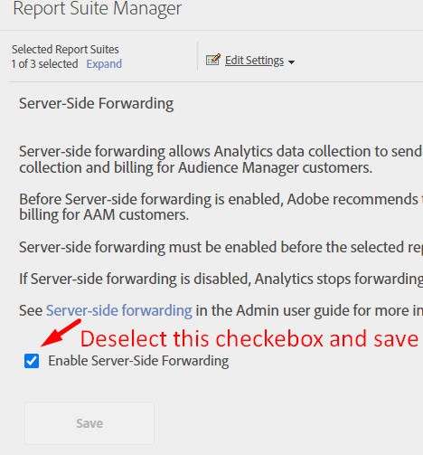
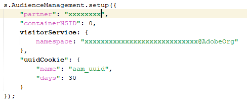
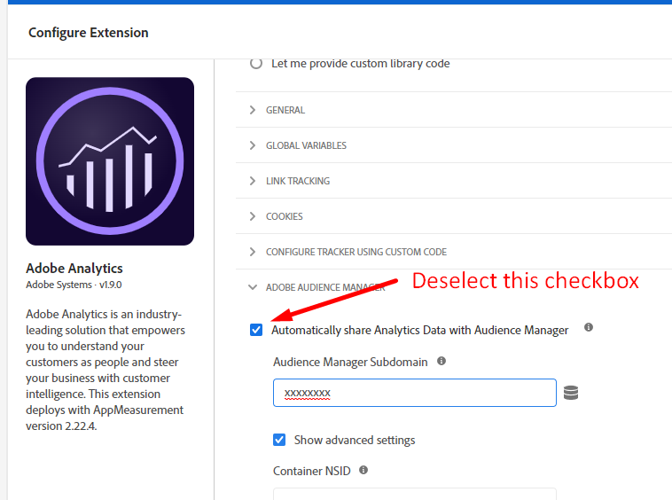

# Entfernen von Audience Manager-Aufrufen

## Beschreibung {#description}

Wie kann ich alle Server-Aufrufe oder Datenflüsse in Audience Manager entfernen?

## Auflösung {#resolution}

Audience Manager kann vollständig entfernt werden, indem seine Verknüpfung an den folgenden Stellen entfernt wird:

1. Entfernen des DIL-Codes
2. Entfernen der Server-seitigen Weiterleitung in der Adobe Analytics-Bibliothek
3. Veröffentlichung aller Analytics-Segmente aufheben
4. Import-/Export-Workflows in Adobe Campaign stoppen
5. Aufrufe von Adobe Target stoppen
6. DCM-Protokollaufname und Pixel-Aufrufe von Drittanbietern stoppen
7. Alle Ziele, die Daten mit Zweit- oder Drittanbietern teilen, stoppen
8. Alle Offline-Datenerfassungen stoppen

<b>Entfernen des DIL-Codes</b>

1. Identifizieren Sie in Ihrem Code die folgende Funktion und entfernen Sie sie:

   1. DIL.create
   2. DILinstance.api.signals().submit()
   3. DIL.modules.siteCatalyst.init Wenn Sie Daten an Adobe Analytics weiterleiten
   4. GA.submitUniversalAnalytics(); ODER GA.submitUniversalAnalytics(); Wenn Sie Daten an Google Analytics weiterleiten
2. Sobald Sie die obige Funktion entfernt haben, stellen Sie sicher, dass Sie auch die DIL JS-Bibliothek aus Ihrem Code entfernt haben.

<b>Ergebnis</b>: Veröffentlichen Sie Ihre Website erneut und laden Sie sie neu. Sie sollten KEINEN Aufruf als [https://subdomain.demdex.net/event?....](https://subdomain.demdex.net/event?....) sehen.

<b>Entfernen der Server-seitigen Weiterleitung</b>

1. Wechseln Sie zu den Analytics-Report Suites, die für die Server-seitige Weiterleitung aktiviert sind, und deaktivieren Sie das Kontrollkästchen.

 

1. Sobald der obige Schritt abgeschlossen ist, gehen Sie in den Code Ihrer AppMeasurement.js und entfernen Sie den unten stehenden Code oder, falls Sie Launch haben, deaktivieren Sie einfach das Kontrollkästchen für die Weiterleitung an Audience Manager.

             
<b>Ergebnis</b>: Die Analytics-Aufrufantwort sollte leer sein.

<b>Veröffentlichung aller Analytics-Segmente aufheben</b>
Gehen Sie zu den einzelnen Analytics-Segmenten, die veröffentlicht wurden, und heben Sie deren Veröffentlichung auf.
<b>Ergebnis</b>: Die Offline-Segmentfreigabe von Analytics zu Audience Manager wird angehalten.

<b>Import-/Export-Workflows in Adobe Campaign stoppen</b>
Von Audience Manager: Löschen Sie alle Campaign-Ziele
Von Campaign: Löschen Sie Import/Export-Workflows von der Campaign-Benutzeroberfläche oder stoppen Sie sie komplett.
<b>Ergebnis</b>: Das Hin- und Herschieben von Segmenten zwischen Audience und Campaign wird angehalten.

<b>Beenden von Adobe Target-Aufrufen</b>
Wenden Sie sich an Ihren CSM oder Account Manager, um die Funktion „Geteilte Audiences“ oder „People Core Services“ vom Bereitstellungs-Team deaktivieren zu lassen.
<b>Ergebnis</b>: Target führt keine zusätzlichen Aufrufe an Audience Manager durch.

<b>DCM-Protokollaufnahme oder Pixel-Aufrufe von Drittanbietern anhalten</b>
Wenn Sie die DCM-Protokollaufnahme aktiviert haben, stoppen Sie sie bitte und laden Sie keine weiteren Metadatendateien hoch.
Wenn Sie irgendwo ein Impressions-/Klick-/Konversions-Pixel aktiv haben, dann stoppen Sie diese bitte ebenfalls.
<b>Ergebnis</b>: Keine Datenerfassung von Drittanbietern.

<b>Anhalten aller Ziele, die Daten mit Zweit- oder Drittanbietern teilen</b>
URL- und Cookie-Ziele können direkt über die Benutzeroberfläche angehalten werden.
Bei S2S-Zielen können Sie sich an den Support wenden, um die Ziele vollständig zu stoppen.
<b>Ergebnis</b>: Es werden keine Daten aus Audience Manager freigegeben.

<b>Anhalten aller Offline-Datenerfassungen</b>
Wenn Sie Datendateien in Audience Manager hochladen, stoppen Sie dies bitte sofort.
<b>Ergebnis</b>: Es werden keine Offline-Daten hochgeladen.
