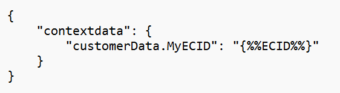

# MID in eine eVar oder eine Prop im mobilen AEP-SDK kopieren

## Beschreibung {#description}

Schritte zum Kopieren der MID in eine eVar oder eine Prop für das mobile AEP-SDK

## Auflösung {#resolution}

- &#x200B; &#x200B; &#x200B; &#x200B; &#x200B;&#x200B;&#x200B;&#x200B;x&#x200B;20000000000000000000000000000000000000000000000000000000000000000000000000000000000000000000000000000000000000000000 
   - Konfiguration:
      - Name: ECID
      - Erweiterung - Mobile Core
      - Datenelementtyp - Experience Cloud-ID &#x200B; &#x200B; &#x200B; &#x200B; &#x200B; &#x200B; &#x200B;
- Erstellen Sie eine Launch-Regel, um die MID in Form von Kontextdaten zu senden.
   - Konfiguration:
      - Ereignisse: Erweiterung - Mobile Core, Ereignistyp - Tracking-Status<b> ODER</b>
      - Erweiterung - Mobile Core, Ereignistyp - Aktion verfolgen
      - Aktionen: Erweiterung - Mobile Core, Aktionstyp - Daten anhängen
      - JSON-Nutzlast - 
         - 
- Erstellen Sie eine Verarbeitungsregel in Analytics, um den Wert der MID in eine eVar- oder Prop-Datei zu kopieren.

   

