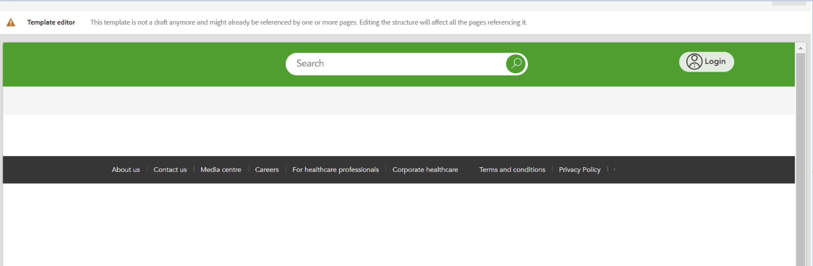

# Neue Implementierung entfernt alle Stile

## Beschreibung {#description}

Nach der Bereitstellung einer Pipeline in einer Umgebung bemerkte der Kunde, dass die benutzerdefinierten Stile aus einer Vorlage und folglich die Stile aus der mit dieser Vorlage erstellten Seite entfernt wurden.

Abbildung 1. Die Vorlage mit den vorhandenen Stilen

Abbildung 2. Die Vorlage ohne Stile

## Lösung {#resolution}

Bei der Überprüfung des Projekts, das der Kunde in seiner Umgebung bereitgestellt hatte, wurde festgestellt, dass die Datei filter.xml unter der Verzweigung, die für die Änderung des Inhalts zuständig war (in diesem Beispiel 1), die Filter 2 enthielt.
Die Vorlage, die nach der Bereitstellung geändert wurde, befindet sich unter &quot;/conf/path/settings/wcm/templates/modified template&quot;, verfügte jedoch über keinen Filtermodus, der standardmäßig auf &quot;replace&quot;verweist.
Dies bedeutet, dass bei jeder Bereitstellung einer Pipeline stattdessen der Pfad im Code verwendet wird.
Dieses Problem muss behoben werden, indem der Filtermodus auf &quot;Zusammenführen&quot;gesetzt wird, wie dies für die anderen Pfade 3 der Fall ist.

1 /aem-cust-project.all-0.0.1-SNAPSHOT/jcr_root/apps/cust-packages/content/install/aem-cust-project.ui.content-0.0.1-SNAPSHOT/META-INF/vault/filter.xml

2 workspaceFilter version=&quot;1.0&quot; filter root=&quot;/conf/path/settings/wcm/templates/modified_template&quot;/ filter root=&quot;/conf/path&quot; mode=&quot;merge&quot;/ filter root=&quot;/conf/path2&quot; mode=&quot;merge&quot;/ filter root=&quot;/content/path2&quot; mode=&quot;merge&quot;/ filter root=&quot;/content/dam/path2/asset.jpg&quot; mode=&quot;merge&quot;/ filter root=&quot;/content /experience-fragments/path2&quot; mode=&quot;merge&quot;/ /workspaceFilter

3 workspaceFilter version=&quot;1.0&quot; filter root=&quot;/conf/path/settings/wcm/templates/modified_template&quot; <b>mode=&quot;merge&quot;</b>/ filter root=&quot;/conf/path&quot; mode=&quot;merge&quot;/ filter root=&quot;/conf/path2&quot; mode=&quot;merge&quot;/ filter root=&quot;/content/path2&quot; mode=&quot;merge&quot;/ filter root=&quot;/content/dam/path2/asset.jpg&quot; mode=&quot;merge&quot;/ filter root=&quot;/content/experience-fragments/path2&quot; mode=&quot;merge&quot;/ /workspaceFilter
