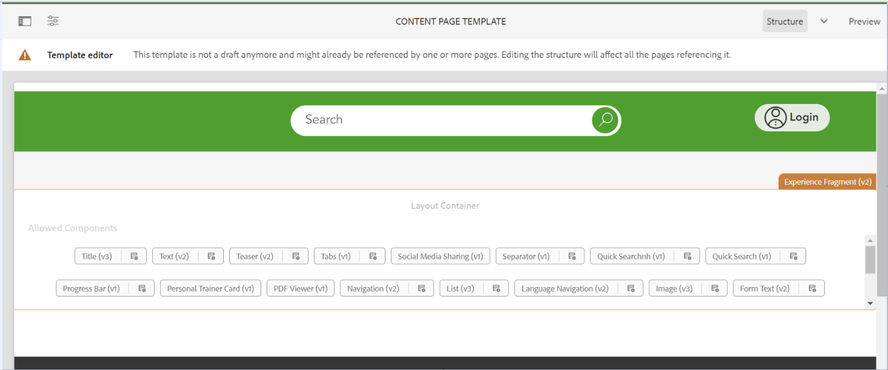

# Die neue Implementierung wird vollständig formatiert entfernt

## Beschreibung {#description}

Nach der Bereitstellung einer Pipeline in einer Umgebung bemerkte der Kunde, dass die benutzerdefinierten Stile aus einer Vorlage und folglich die Stile aus der mit dieser Vorlage erstellten Seite entfernt wurden.

Abbildung 1. Die Vorlage mit den vorhandenen Stilen

Abbildung 2. Die Vorlage ohne Stile

## Lösung {#resolution}

Wenn Sie das Projekt überprüfen, das der Kunde in seinem env bereitgestellt hat, wurde festgestellt, dass die Datei &quot;filter.xml&quot;unter der bereitgestellten Verzweigung den Inhalt 1 enthielt.
Der Pfad &quot;/conf/path/settings/wcm/templates/modified_template&quot;, der die geänderte Vorlage enthält, hatte den Standardfiltermodus, d. h. &quot;replace&quot;.
Das bedeutet, dass der Pfad jedes Mal, wenn der Kunde eine Pipeline bereitstellt, durch den Pfad im bereitgestellten Projekt ersetzt wird.
Um dies zu beheben, muss der Filtermodus wie bei den anderen Pfaden auf &quot;Zusammenführen&quot;gesetzt werden.

1 workspaceFilter version=&quot;1.0&quot; filter root=&quot;/conf/path/settings/wcm/templates/modified_template&quot;/ filter root=&quot;/conf/path&quot; mode=&quot;merge&quot;/ filter root=&quot;/conf/path2&quot; mode=&quot;merge&quot;/ filter root=&quot;/content/path2&quot; mode=&quot;merge&quot;/ filter root=&quot;/content/dam/path2/asset.jpg&quot; mode=&quot;merge&quot;/ filter root=&quot;/content /experience-fragments/path2&quot; mode=&quot;merge&quot;/ /workspaceFilter
