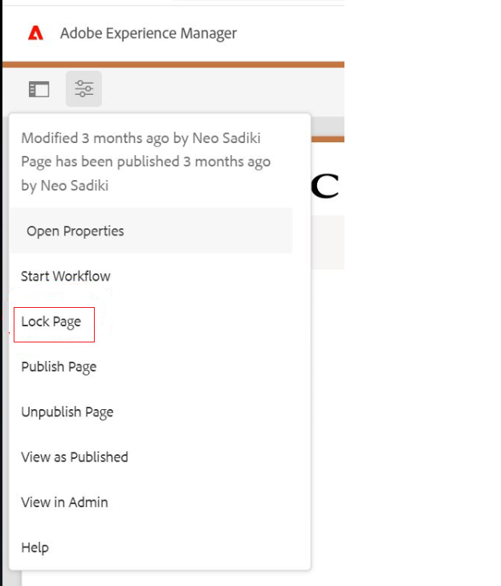
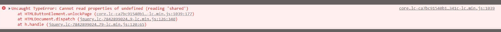

# Option zum Entsperren der Seite funktioniert nicht

## Beschreibung {#description}

<b>Umgebung</b>
Experience Manager


<b>Problem/Symptome</b><br>Beim Versuch, eine Seite über die Seitenleiste der Seite zu sperren/zu entsperren (Bild 1), kann ein Benutzer sie nur sperren. Beim Versuch, diese zu entsperren, wird der Fehler im Bild 2 angezeigt und die Seite kann nicht entsperrt werden. <br>Die Seite kann jedoch erfolgreich über die Site-Admin Console 3 gesperrt/entsperrt werden.<br><br> <br><br><br><br>Bild 1<br><br> <br><br> <br><br><br><br>Bild 2<br><br> <br><br> <br><br><br><br>Bild 3<br>

## Auflösung {#resolution}


Die Fehlermeldung 1 beim erfolglosen Versuch, eine Seite zu entsperren, erscheint, weil die Seite die Client-Bibliothek `cq.shared` nicht enthält.

Um dies zu beheben, muss der Benutzer eine Abhängigkeit von dieser Client-Bibliothek definieren, damit sie für seine benutzerdefinierte Inhaltsseite geladen wird.


```
1 core.lc-ca7bc91540b118ca20ea6d0db684341c-lc.min.js:1039

Uncaught TypeError: Cannot read properties of undefined (reading 'shared')
at HTMLButtonElement.unlockPage (core.lc-ca7bc91540b118ca20ea6d0db684341c-lc.min.js:1039:177)
at HTMLDocument.dispatch (jquery.lc-7842899024219bcbdb5e72c946870b79-lc.min.js:126:340)
at h.handle (jquery.lc-7842899024219bcbdb5e72c946870b79-lc.min.js:120:65)
```
