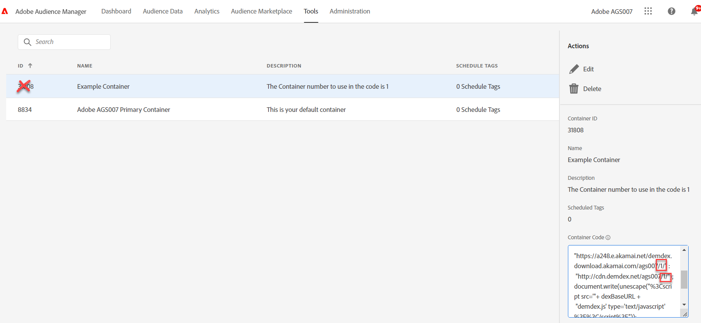

# Was ist meine Container-ID für Audience Manager (und/oder ID-Service) und wo finde ich diese?

## Beschreibung {#description}

Wenn eine andere Container-ID als die Standard-ID (0) für eine Implementierung von AAM (und/oder ID-Service) benötigt wird, woher weiß man dann, welche Container-ID zu verwenden ist? Ist es die Container-ID in der AAM-Benutzeroberfläche oder ein anderer Wert?

## Auflösung {#resolution}

Wenn eine AAM-Implementierung eine andere Container-ID anstelle des Standard-Containers (0) verwenden muss, dann ist der Wert, der in den ID-Service und das Audience Management-Modul für Analytics (oder in den DIL-Konfigurations-Code) eingegeben werden muss, die Container-Nummer, die darauf basiert, wann der Container erstellt wurde, NICHT die Container-ID in der AAM-Benutzeroberfläche. Um den richtigen Wert zu erhalten, führen Sie die folgenden Schritte aus:

1. Melden Sie sich bei Audience Manager an und klicken Sie auf Werkzeug-Tags
2. Wenn die Seite „Tags“ geladen ist, klicken Sie auf den betreffenden Container
3. Suchen Sie in der rechten Leiste das Feld „Container-Code“
4. Suchen Sie die Anfrage akamai.net oder cdn.demdex.net. Die Zahl im Pfad direkt nach der Mandanten-ID ist der numerische Wert, der im Code verwendet werden muss. Verwenden Sie NICHT die Container-ID. Im folgenden Beispiel/Screenshot ist der zu verwendende Wert 1.

Hinweis: Der Code im Feld „Container-Code“ ist KEIN Code, den Sie in Web-Eigenschaften einfügen sollten. Er dient nur dazu, den Container-Wert für die idSyncContainerID-Konfiguration des ID-Service, den Container-NSID-Wert des Audience Management-Moduls von Analytics oder den containerNSID-Wert einer DIL-Implementierung zu erhalten, wenn etwas anderes als der standardmäßige ID-Sync-Container benötigt wird.
