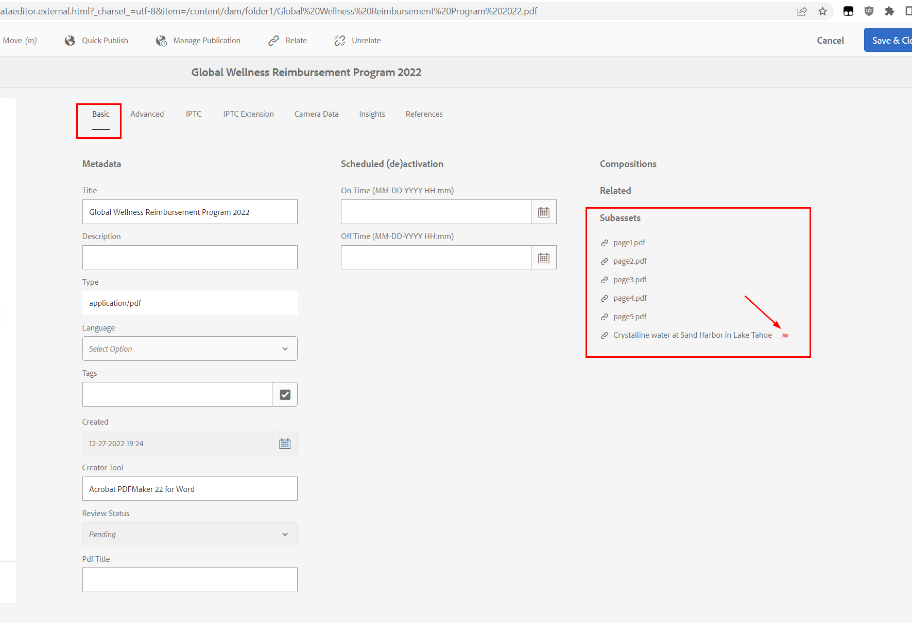

# Status &quot;Untergeordnetes ASSET&quot;für Asset angezeigt

## Beschreibung {#description}

Beim Durchsuchen des Assets zeigen einige Assets den Status &quot;SUB-ASSET&quot;:

Was bedeutet das?

## Auflösung {#resolution}

Die <b>*UNTERASSET</b>* Der Status entspricht dem, wenn Ihr Asset einige <b>Zugehörige Assets</b> für die *Digital Rights Management* Datum abgelaufen ist.

Dies ist ein spezieller Fall des Szenarios, in dem das Haupt-Asset selbst abgelaufen ist, wie hier beschrieben:

[https://experienceleague.adobe.com/docs/experience-manager-65/assets/administer/drm.html?lang=en#asset-expiration](https://experienceleague.adobe.com/docs/experience-manager-65/assets/administer/drm.html?lang=en#asset-expiration)

Sie können überprüfen, welches zugehörige Asset abgelaufen ist, indem Sie die Eigenschaften des Assets öffnen *Allgemein* Registerkarte und Beobachtung der *rote Markierung* Symbol:

Die <b>Zugehörige Assets</b> Es handelt sich um zwei Arten:

<u><b>#1 - Asset ist eine PDF mit Unterseiten</b></u>

Wenn Sie Ihr &quot;DAM-Update-Asset&quot;geändert haben, um Seiten aus Ihrer PDF zu extrahieren, wird ein Unter-Asset für die Dokumentseiten erstellt.

Jede extrahierte Seite ist ein Asset, das unter dem Haupt-Asset in einem Unterknoten/Ordner mit dem Namen &quot;/subassets&quot;gespeichert ist und Metadateneigenschaften wie DRM aufweist. *Läuft ab* Datum im *Erweitert* Registerkarte.

Wenn dies *Läuft ab* Das Datum ist abgelaufen. Sie sehen Folgendes:

- die <b>*ABGELADEN</b>* Status dieser Unterseite/dieses Assets beim Durchsuchen der wichtigsten PDF-Teil-Assets (in der linken oberen Leiste wechseln Sie von *Nur Inhalt* Ansicht zu *Unter-Assets*)
- die <b>*UNTERASSET</b>* Status beim Zurücksetzen auf die Haupt-PDF

Dies wird auf der folgenden Seite 0 dokumentiert.

<u><b>#2 - Asset hat Verweise auf Assets</b></u>

Bei jedem Asset-Typ ist es möglich, auf andere Assets zu verweisen. Die <b>*UNTERASSET</b>* -Status berechnet wird, indem auch die *Läuft ab* Datum jedes dieser Verweise.

Diese Verweise werden in einer -Eigenschaft gespeichert:

*asset/jcr:content/related/links/sling:members/sling:resources*

<u>Hinweis:</u>

Wenn Ihr Asset zu viele Verweise enthält (mehrere Tausend), kann dies beim Versuch, die Asset-Eigenschaften anzuzeigen, zu Leistungsproblemen der Benutzeroberfläche führen.

Das Überprüfen/Berechnen des Status aller Verweise kann zu lange dauern, und die Anfrage zum Öffnen der Eigenschaften wird mit einem Timeout beendet.

Zu viele Verweise betreffen und müssen untersucht werden, da dies Leistungsprobleme verursachen kann:

[https://jackrabbit.apache.org/oak/docs/dos_and_donts.html#Large_Multi_Value_Property](https://jackrabbit.apache.org/oak/docs/dos_and_donts.html#Large_Multi_Value_Property)

Um das Problem zu beheben, können Sie den folgenden Ordner/Unterknoten aus CRX/DE löschen, wenn diese zugehörigen Verweise keinen Wert enthalten:

*/content<b>t</b>/../asset/jcr:content/related/links*

<u><b>#3 - Tipps zum Überprüfen abgelaufener Assets</b></u>

Sie können die folgende JCR SQL2-Abfrage verwenden, um alle Assets in Ihrem Repository aufzulisten, deren Ablaufdatum erreicht ist:

*WÄHLEN SIE \* FROM dam:Asset WHERE jcr:content/metadata/prism:expirationDate cast(&#39;2023-01-02T17:00:00.000Z&#39; als Datum)*

Ändern Sie das Datum in die aktuelle Uhrzeit (im GMT-Format).
