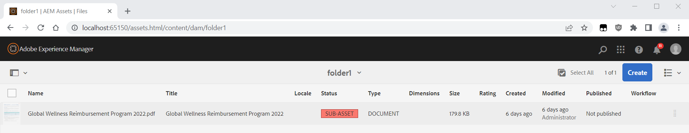

# TEIL-ASSET-Status für Asset angezeigt

## Beschreibung {#description}

<b>Umgebung</b>
- Experience Manager
- Experience Manager 6.5

<b>Problem/Symptome</b>
Beim Durchsuchen des Assets zeigen einige Assets den Status „TEIL-ASSET“ an:

Was bedeutet das?

## Auflösung {#resolution}

Der <b>*TEIL-ASSET</b>*-Status besteht, wenn Ihr Asset einige <b>verwandte Assets</b> hat, deren *Digital Rights Management* Datum abgelaufen ist.

Dies ist ein spezieller Fall des hier dokumentierten Szenarios, bei dem das Haupt-Asset selbst abgelaufen ist:

[https://experienceleague.adobe.com/docs/experience-manager-65/assets/administer/drm.html?lang=de#asset-expiration](https://experienceleague.adobe.com/docs/experience-manager-65/assets/administer/drm.html?lang=de#asset-expiration)

Sie können überprüfen, welches zugehörige Asset abgelaufen ist, indem Sie die Registerkarte *Standard* des Assets öffnen und das Symbol mit der *roten Markierung* beobachten:

Es handelt sich um zwei Arten von <b>zugehörigen Assets</b>:

<u><b>#1 – Asset ist ein PDF mit Unterseiten</b></u>

Wenn Sie Ihr „DAM Update Asset“ so geändert haben, dass es Seiten aus Ihrem PDF extrahiert, wird ein Teil-Asset für die Dokumentseiten erstellt.

Jede extrahierte Seite ist ein Asset, das unter dem Haupt-Asset in einem Unterknoten/-ordner mit dem Namen „/subassets“ hinterlegt ist und über Metadaten-Eigenschaften verfügt, einschließlich des DRM-*Ablauf*-Datums auf der Registerkarte *Erweitert*.

Wenn dieses *Ablauf*-Datum erreicht ist, sehen Sie Folgendes:

- den Status <b>*ABGELAUFEN</b>* für diese Unterseite/dieses Teil-Asset beim Durchsuchen der Teil-Assets des Haupt-PDFs (durch Wechsel über die obere linke Leiste von der Ansicht *Nur Inhalt* zu *Teil-Assets*)
- den Status <b>*TEIL-ASSET</b>*, wenn Sie zum Haupt-PDF zurückkehren

Dies wird auf der folgenden Seite 0 dokumentiert.

<u><b>#2 – Asset hat Verweise auf Assets</b></u>

Für jede Art von Asset ist es möglich, auf andere Assets zu verweisen. Der Status <b>*TEIL-ASSET</b>* wird auch anhand des *Ablauf*-Datums jeder dieser Verweise berechnet.

Diese Verweise werden in einer Eigenschaft gespeichert:

`asset/jcr:content/related/links/sling:members/sling:resources`

<u>Hinweis:</u>

Wenn Ihr Asset zu viele Verweise hat (mehrere Tausend), kann dies zu Leistungsproblemen der Benutzeroberfläche führen, wenn Sie versuchen, die Eigenschaften des Assets anzuzeigen.

Das Überprüfen bzw. Berechnen des Status all dieser Verweise könnte zu viel Zeit in Anspruch nehmen, und die Anfrage zum Öffnen der Eigenschaften würde eine Zeitüberschreitung hervorrufen.

Zu viele Verweise sind bedenklich und müssen untersucht werden, da sie zu Leistungsproblemen führen können:

[https://jackrabbit.apache.org/oak/docs/dos_and_donts.html#Large_Multi_Value_Property](https://jackrabbit.apache.org/oak/docs/dos_and_donts.html#Large_Multi_Value_Property)

Um das Problem zu beheben, wenn diese Verweise keinen Nutzen bringen, können Sie den folgenden Ordner/Unterknoten aus CRX/DE löschen:

*/conten<b>t*`/.../asset/jcr:content/related/links`

<u><b>#3 – Tipps zur Überprüfung abgelaufener Assets</b></u>

Durch Verwendung der folgenden JCR SQL2-Abfrage lassen sich alle Assets im Repository mit erreichtem Verfallsdatum auflisten:

`SELECT * FROM dam:Asset WHERE jcr:content/metadata/prism:expirationDate  cast('2023-01-02T17:00:00.000Z' as date)`

Ändern Sie das Datum in die aktuelle Zeit (im GMT-Format).
