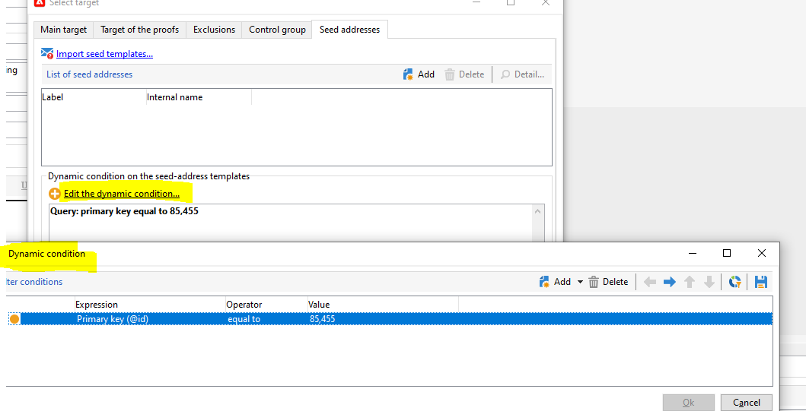

# Testadressen werden bei der Ausführung eines wiederkehrenden Versands dupliziert

## Beschreibung {#description}

Wenn die Kundin oder der Kunde bei einem wiederkehrenden Versand eine neue Testadresse hinzufügt, wird jedes Mal, wenn der wiederkehrende Versand ausgeführt und eine neue Versandinstanz erstellt wird, auch eine neue Testadresse erstellt (mit denselben Eigenschaften, aber einer anderen ID/einem anderen internen Namen).      So lässt sich das Problem reproduzieren:  1. Neue Kampagne erstellen und unter ihrem Arbeitsablauf einen neuen wiederkehrenden Versand hinzufügen.
 2. Im neuen wiederkehrenden Versand eine neue Testadresse hinzufügen und speichern. = Im Testadressen-Ordner überprüfen, ob die neue Testadresse erstellt wurde.
 3. Ausführen des wiederkehrenden Versands = Eine duplizierte Testadresse wird erstellt und in der neuen Versandinstanz verwendet.

## Auflösung {#resolution}

Dies funktioniert wie vorgesehen. Eine Verbesserungsanfrage ist derzeit unter [NEO-12892](https://jira.corp.adobe.com/browse/NEO-12892) geöffnet, um das zu ändern.

In der Zwischenzeit sollten Kundinnen und Kunden Testadressen mit dynamischen Bedingungen verwenden, um Dopplungen zu vermeiden:

