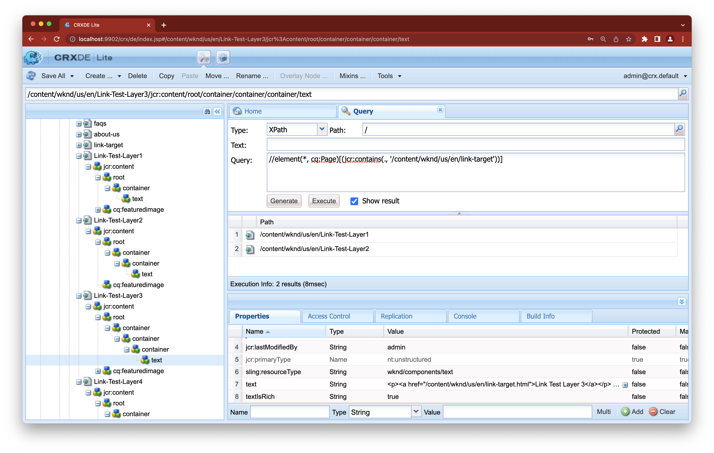
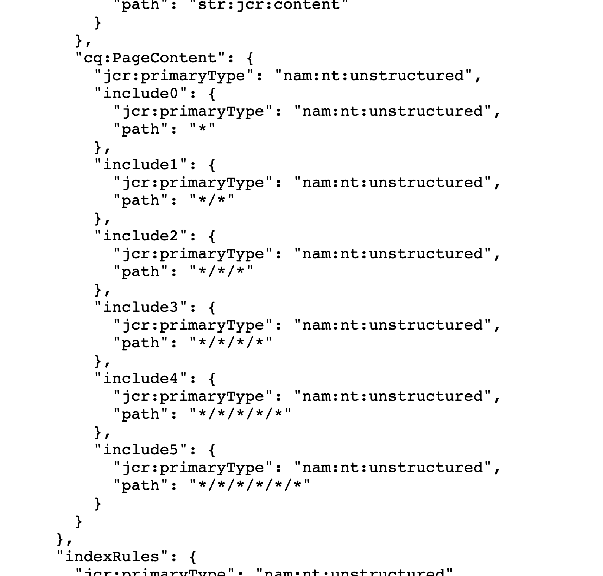
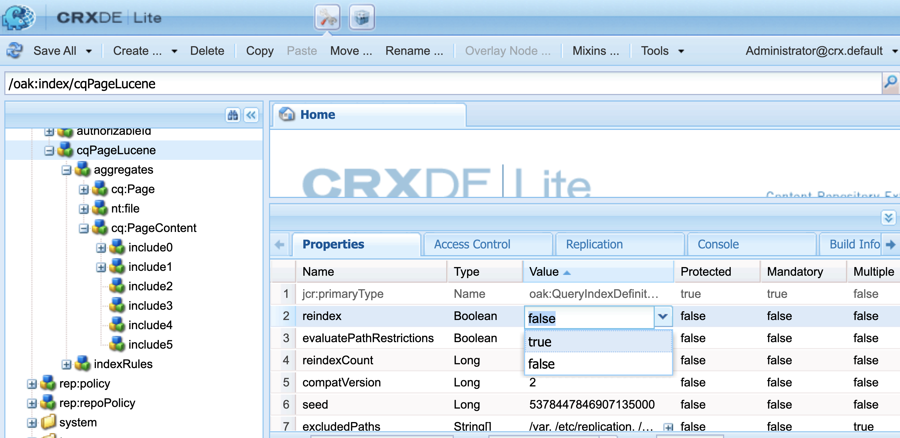

# Adobe Experience Manager: Die eingehenden Links zeigen nicht alle verknüpften Seiten an

## Beschreibung {#description}

Wenn sich ein Knoten mit einem Link in einer tieferen Ebene als 4 Ebenen vom jcr:content seiner Seite befindet, wird die Seite nicht in den eingehenden Links des Link-Ziels angezeigt.

・ Wenn eine Verknüpfungsseite in den eingehenden Links angezeigt wird:   /content/wknd/us/de/link-page/jcr:content 1 /root 2 /container 3 /container 4 /text(link)

・ Wenn eine Verknüpfungsseite nicht in den eingehenden Links angezeigt wird:   /content/wknd/us/de/link-page/jcr:content 1 /root 2 /container 3 /container 4 /container 5 /text(link)

<b>Umgebungen</b>
AEM as a Cloud Service, AEM 6.5

## Auflösung {#resolution}

Überprüfen Sie mithilfe von CRXDE Lite die Hierarchie der Knoten, die den Link enthalten.

Überprüfen Sie die Struktur der Seite und passen Sie sie an, sodass sich der Link-Knoten auf einer flachen Ebene befinden kann.
Wenn die Ebene des verknüpfenden Knotens auf einer tiefen Ebene bleibt, passen Sie einen Index an, um die für die eingehende Link-Suche zu indizierende Ebene zu erhöhen.

Wählen Sie mit CRX/DE Lite /oak:index/cqPageLucene/aggregates/cq:PageContent aus.
  Erstellen Sie einen neuen Knoten und fügen Sie eine Eigenschaft &quot;path&quot;hinzu, die die erforderliche Hierarchieebene ausdrückt.

- Im folgenden Beispiel werden &quot;include4&quot;und &quot;include5&quot;hinzugefügt, um die Anzahl der eingehenden Links, die bis zu 6 suchen, zu erhöhen.

Um eine Neuindizierung durchzuführen, ändern Sie den Wert der Eigenschaft reindex von /oak:index/cqPageLucene in true und speichern Sie sie.

  
    - Nach Abschluss der Neuindizierung wird die folgende Meldung in error.log angezeigt.

`    13.01.2023 12:00:45.264 *INFO* async-index-update-async org.apache.jackrabbit.oak.plugins.index.AsyncIndexUpdate async Reindexing completed for indexes: /oak:index/cqPageLucene*(788) in 733.7 ms (733 ms)`

Die Neuindizierung kann zu Leistungsproblemen führen.
    Es wird empfohlen, die Neuindizierungsaufgabe relativ ruhig zu planen.
