# Beispiele für request.log-Analyse | AEM

## Beschreibung {#description}

### <b>Umgebung</b>

Experience Manager 6.5

### <b>Problem/Symptome</b>

Die Adobe Experience Manager (AEM) `request.log` enthält verschiedene nützliche Informationen, z. B. die Antwortzeit, um Leistungsprobleme zu analysieren. Im Folgenden finden Sie eine Liste von Beispielen für Analysen mit Linux-Befehlen (einschließlich einiger externer Befehle wie Ruby `[` 1`]`  und datamash `[` 2`]` ).

<u>Installationsanleitungen</u>

`[` 1`]`  [https://www.ruby-lang.org/en/documentation/installation/](https://www.ruby-lang.org/en/documentation/installation/)

`[` 2`]`  [https://www.gnu.org/software/datamash/download/](https://www.gnu.org/software/datamash/download/)

## Auflösung {#resolution}

### Inhaltsverzeichnis

<b>A. Einleitung</b>

- Format `request.log`

<b>B. Vorbereitungsschritte</b>

1. Datenbereinigung
2. Neustart
3. Anzahl der Zugriffe pro Stunde
4. Maximale gleichzeitige Verarbeitung
5. Aufteilen einer Protokolldatei
6. Zusammenführen von Anforderungsdatensätzen und Antwortdatensätzen

<b>C. Beispiele für Analysen</b>

1. Die schwersten Zugriffe
2. Zugreift auf fehlende Antwort
3. Langsame Zugriffe
4. Zeitreihendaten der Antwortzeit
5. Minimum, Mittel (Durchschnitt), Median, maximale Reaktionszeit
6. Anzahl der Zugriffe pro Zeitraum
7. Anzahl der Antwortstatus pro Zeitraum
8. Häufigste URLs
9. `access.log` Datensätze für `request.log` record

<b>D. Schlussfolgerung</b>

#### <b>A. <u>Einführung</u></b>

Das Format `request.log`

AEM 6.5 generiert `request.log` standardmäßig im folgenden Format angezeigt. Aufgrund einer Systembegrenzung werden die Befehlszeilen in diesem Artikel als Bilder anstelle von Nur-Text angezeigt.

Beispiel für `request.log`:
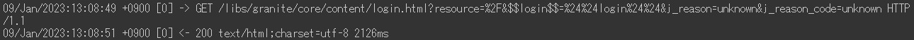

In diesem Artikel wird eine Zeile mit &quot;-`>` &quot; wird als &quot;Anforderungsdatensatz&quot;bezeichnet. Eine Zeile mit &quot;`<` -&quot;ist ein &quot;Antwortdatensatz&quot;.

<u>Datensatz anfordern</u>:

Wenn eine Anfrage von AEM empfangen wird, wird ein Anforderungsdatensatz protokolliert. Sie enthält das Datum und die Uhrzeit des Eingangs, die Anforderungs-ID, die Anforderungsmethode und die URL.

<u>Antwortdatensatz</u>:

Wenn AEM auf eine Anfrage antwortet, wird ein Antwortdatensatz protokolliert. Sie enthält das Datum und die Uhrzeit der Antwort, die Anfrage-ID, den Statuscode, den Inhaltstyp und die Antwortzeit (in Millisekunden).

Suchen Sie das entsprechende Handbuch unter [Interpretieren von request.log](https://experienceleague.adobe.com/docs/experience-manager-65/deploying/configuring/monitoring-and-maintaining.html#interpreting-the-request-log).

#### <b>B. <u>Vorbereitungsschritte</u></b>

<u>Schritt 1. Datenbereinigung</u>

Vor dem Eintauchen in die Analyse von `request.log`ist es wichtig, die Protokolleinträge zu standardisieren.

Die erste `sed` entfernt zusätzlichen Platz in den Inhalts-Typ der Antwortdatensätze, um eine falsche Feldtrennung mit Leerzeichen zu verhindern. Der Ruby-Befehl (siehe <b>`[` 1`]` </b> oben zur Installation von Ruby) konvertiert das Datumsformat nach ISO 8601. Der Ruby-Befehl trennt außerdem Datum und Uhrzeit durch Leerzeichen anstelle eines Doppelpunkts.

<u>Schritt 2. Neustart</u>

Wenn AEM neu gestartet und eine Service Pack-Installation installiert wird, wird die Anforderungs-ID von zurückgesetzt `request.log`. Die Anfrage zeichnet mit Anfrage auf `ID = 0` gibt an, dass es diese Arten von Operationen geben könnte.

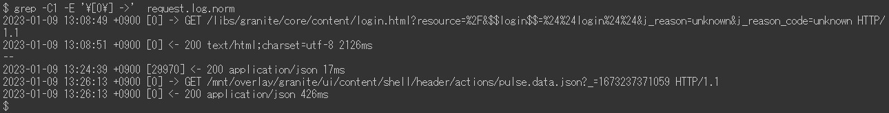

Im obigen Beispiel wurden Anfrage-IDs bei 13 auf 0 zurückgesetzt:08:49 und 13:26:13.

<u>Schritt 3. Anzahl der Zugriffe pro Stunde</u>

Zählen Sie die Anzahl der Zugriffe pro Stunde und den Zeitbereich der `request.log`.

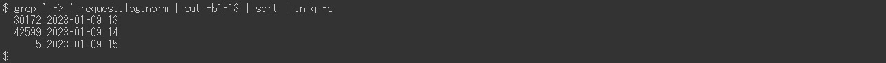

<u>Schritt 4. Maximale gleichzeitige Verarbeitung</u>

Die Anzahl der gleichzeitigen Verarbeitung hilft dabei, die Serverlast von AEM zu erraten.

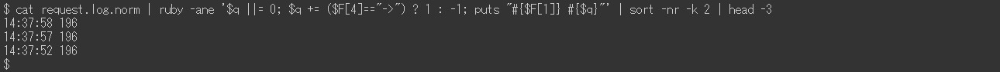

Standardmäßig ist die maximale Anzahl gleichzeitiger Verbindungen für Jetty in AEM auf 200 festgelegt. Es gibt eine Verzögerung beim Freigeben des Sockets nach Abschluss der Antwort. Wenn die Anzahl der gleichzeitigen Verarbeitungen ca. 170 überschreitet, können keine neuen Anforderungen mehr akzeptiert werden.

<u>Schritt 5. Aufteilen einer Protokolldatei</u>

Die Anfrage-ID von `request.log` wird zurückgesetzt, wenn AEM neu gestartet oder ein Service Pack installiert wird. Aufgrund dieses Verhaltens kann die Analyse falsch sein, wenn eine `request.log` enthält solche Vorgänge. Um eine genaue Analyse durchzuführen und die gleichzeitig verarbeitete Dateigröße zu verringern, teilen Sie die `request.log` Verwenden von Anforderungsdatensätzen mit der Anforderung `ID = 0`.

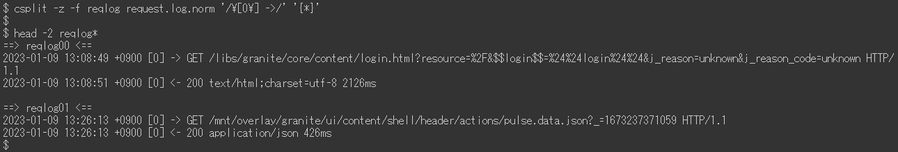

<u>Schritt 6. Zusammenführen von Anforderungsdatensätzen und Antwortdatensätzen</u>

Die Verknüpfung von Anfrage- und Antwortdatensätzen mit der Anfrage-ID erleichtert den Einstieg in Leistungsprobleme. Diese zusammengeführte Protokolldatei wird in den späteren Beispielen verwendet.

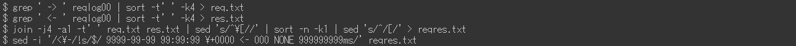

Die letzte `sed` fügt eine Platzhalterantwort zu Anfragedatensätzen hinzu, die keinen entsprechenden Antwortdatensatz aufweisen. Es kann auch Antwortdatensätze ohne Anfragedatensätze geben. Sie sind jedoch unwissbar, da sie normalerweise nicht Gegenstand von Untersuchungen sind.

Die zusammengeführte Protokolldatei sollte wie folgt aussehen:

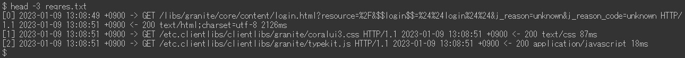

#### <b>C. <u>Beispiele für Analysen</u></b>

<u>Beispiel 1. Die schwersten Zugriffe</u>

Sortieren Sie die zusammengeführte Protokolldatei nach Antwortzeit in absteigender Reihenfolge, einschließlich Zugriffen ohne Antwort.

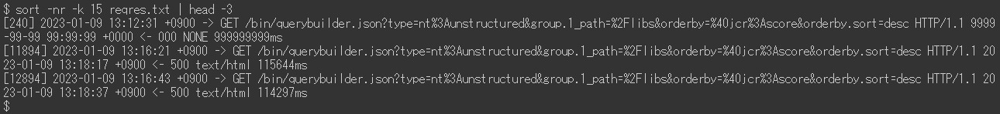

<u>Beispiel 2. Zugreift auf fehlende Antwort</u>

Extrahieren Sie mithilfe der Platzhalterantwortzeit auf die fehlenden Antwortdatensätze.

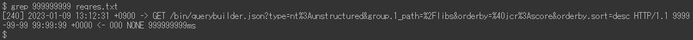

Wenn der Zeitpunkt des Empfangs von Zugriffen ohne Antwort mit einer erhöhten Server-Last korreliert wird, können diese Zugriffe Leistungsprobleme ausgelöst haben.

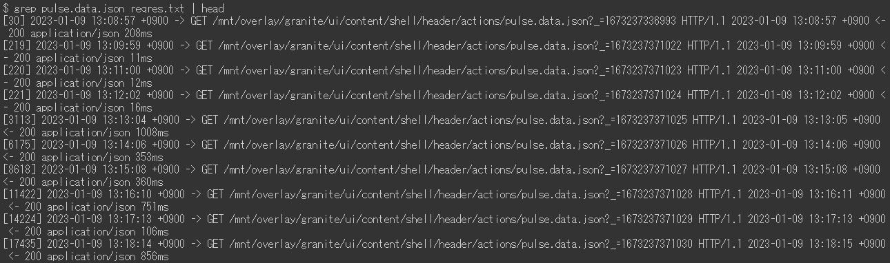

<u>Beispiel 3. Langsame Zugriffe</u>

Extrahieren Sie Zugriffe, die länger als 10 Sekunden dauerten.

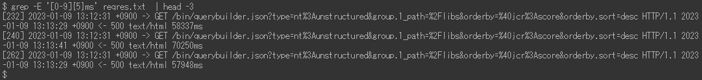

Wenn die Anzahl der Treffer zu hoch ist, ersetzen Sie `[ 0-9] {5}` mit `[ 0-9] {6}` im `grep` -Befehl zum Eingrenzen auf Zugriffe, die länger als 100 Sekunden dauerten.

<u>Beispiel 4. Zeitreihendaten der Antwortzeit</u>

Zum Erstellen von Diagrammen ist es nützlich, nur den Zeitstempel und die Antwortzeit aus den Daten zu extrahieren.

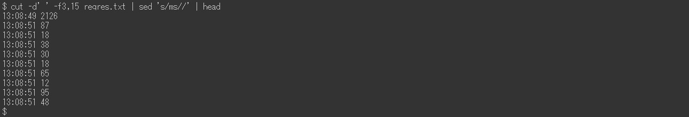

Wenn Sie keine Zugriffe zulassen, die sofort reagiert haben, werden die Daten effizienter. Im folgenden Beispiel wird der Zugriff extrahiert, der mehr als eine Sekunde dauerte.

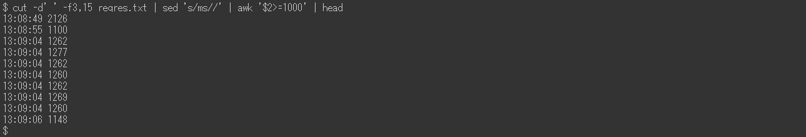

<u>Beispiel 5. Minimum, Mittel (Durchschnitt), Median, maximale Reaktionszeit</u>

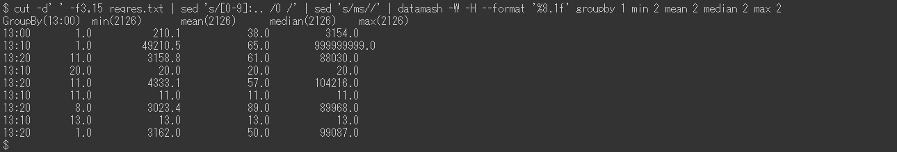

Im obigen Beispiel wird der Befehl datamash (https://www.gnu.org/software/datamash/) für die statistische Verarbeitung verwendet. Wenn das Protokoll Zugriffe ohne Antwort enthält, beeinflusst der Platzhalterwert das Ergebnis.

<u>Beispiel 6. Anzahl der Zugriffe pro Zeitraum</u>

Zählen Sie die Anzahl der Zugriffe pro zehn Minuten. Das Ergebnis hilft dabei festzustellen, ob ein Leistungsproblem durch großen Traffic verursacht wurde.

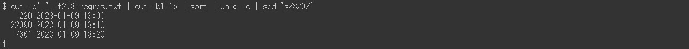

Im folgenden Beispiel werden die Daten auf nur POST-Anfragen reduziert. Ein typischer Anwendungsfall besteht darin zu ermitteln, ob eine Konzentration von Inhaltserstellung oder -replikation auf die Veröffentlichungsstufe vorhanden ist.

<u>Beispiel 7. Anzahl der Antwortstatus pro Zeitraum</u>

Erstellen Sie mit dem Befehl datamash eine Tabelle mit der Anzahl der einzelnen Antwortstatus pro zehn Minuten.

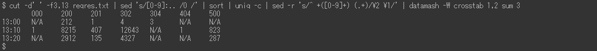

<u>Beispiel 8. Häufigste URLs</u>

Drucken Sie die drei wichtigsten URLs, auf die am häufigsten pro zehn Minuten zugegriffen wurde.

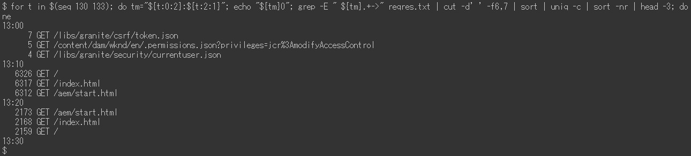

Beispiel 9. `access.log` Datensätze für `request.log` record

Suche `access.log` für Datensätze, die einer bestimmten Anfrage-ID entsprechen.

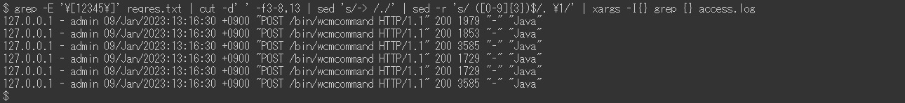

Wenn mehrere Zugriffe auf dieselbe URL gleichzeitig erfolgt sind, zeigt das Ergebnis mehrere `access.log` Datensätze für eine einzige Anfrage-ID.

#### <b>D. Schlussfolgerung</b>

Die Beispiele in diesem Artikel sollen Ihnen bei der Analyse Ihrer Leistungsprobleme helfen.

Die aufgeführten Beispiele wurden mit CentOS 7.5 und Ubuntu 22.04LTS getestet, funktionieren jedoch möglicherweise nicht wie erwartet in Abhängigkeit von Ihrer Umgebung, wie z. B. verschiedenen Versionen oder Variationen der Befehle. Passen Sie sie entsprechend an die in Ihrer Umgebung installierten Befehle an.
