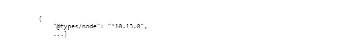

# Die Pipeline-Implementierung schlägt während des Build-Schritts fehl

## Beschreibung {#description}

<b>Umgebung</b>
Experience Manager as a Cloud Service


<b>Problem/Symptome</b>
Die Pipelineausführung schlägt während des Build-Schritts aufgrund von Fehlern im `ui.frontend` Code.

Sie beobachten ERROR-Meldungen wie die folgenden im `build.log` Datei:


```
12:52:44,558 Exec Stream Pumper INFO ERROR in /build_root/build/program/ui.frontend/node_modules/@types/node/ts4.8/util.d.ts
12:52:44,559 Exec Stream Pumper INFO tsl ERROR in /build_root/build/program/ui.frontend/node_modules/@types/node/ts4.8/util.d.ts(1485,42)
12:52:44,561 Exec Stream Pumper INFO TS1005: ',' expected.
12:52:44,561 Exec Stream Pumper INFO
12:52:44,561 Exec Stream Pumper INFO ERROR in /build_root/build/program/ui.frontend/node_modules/@types/node/ts4.8/util.d.ts
12:52:44,562 Exec Stream Pumper INFO tsl ERROR in /build_root/build/program/ui.frontend/node_modules/@types/node/ts4.8/util.d.ts(1485,44)
12:52:44,563 Exec Stream Pumper INFO TS1068: Unexpected token. A constructor, method, accessor, or property was expected.
12:52:44,563 Exec Stream Pumper INFO
12:52:44,563 Exec Stream Pumper INFO ERROR in /build_root/build/program/ui.frontend/node_modules/@types/node/ts4.8/util.d.ts
12:52:44,564 Exec Stream Pumper INFO tsl ERROR in /build_root/build/program/ui.frontend/node_modules/@types/node/ts4.8/util.d.ts(1485,57)
12:52:44,564 Exec Stream Pumper INFO TS1005: ';' expected.
12:52:44,564 Exec Stream Pumper INFO
```


## Auflösung {#resolution}

<b>Folgen Sie den unten angegebenen Schritten:</b>
1. Suchen Sie im Stammverzeichnis des Git Repo die Datei . `pom.xml,` und suchen Sie die Knotenversion, z. B. `nodeVersionv10.13.0/nodeVersion`


2. Suchen `ui.frontend/package.json,` und fügen Sie die bereits vorhandene `devDependencies` -Objekt: z. B. &quot;devDependencies&quot;:

   


<br>Hinweis:<br>


1. Das v aus nodeVersion <b>v10.13.0</b> darf nicht kopiert werden.


2. Die Knotenversion könnte in Ihrem Fall anders sein. Beispiel: <b>12,22,7</b>

