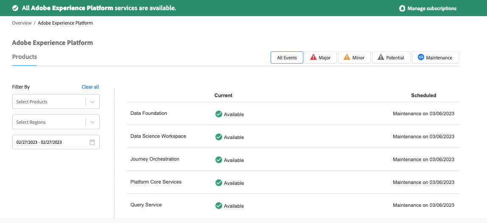

# Ist die Adobe Experience Platform nicht da?

## Beschreibung {#description}

<b>Umgebung</b>

Adobe Experience Platform (AEP)

<b>Problem/Symptome</b>

Funktioniert die Adobe Experience Platform nicht?

## Auflösung {#resolution}

Wenn etwas nicht erwartungsgemäß funktioniert, überprüfen Sie die Seite &quot;Adobe Status&quot; unter [Experience Platform zum Adobe-Status](https://status.adobe.com/cloud/experience_platform#/).

Adobe Status bietet Informationen zur Dienstverfügbarkeit und Leistungsbeeinträchtigung für alle Adobe-Produkte und -Services. Sie umfasst Vorfälle und Wartungsarbeiten, die noch nicht abgeschlossen sind oder sich bereits auf Produkte der Adobe auswirken.

<b>Hinweis</b>: Sie können auch Warnhinweise/Benachrichtigungen zu geplanten/ungeplanten Ausfallzeiten abonnieren.

Siehe Beispiel unten:

