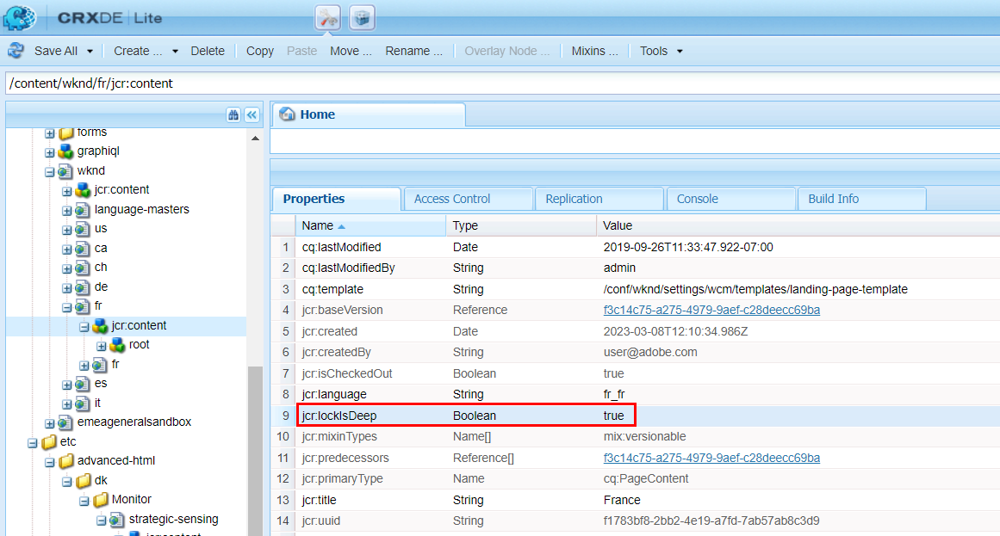

# Verteilungswarteschlange mit AccessDeniedException blockiert

## Beschreibung {#description}

Wenn Sie versuchen, einige Seiteninhalte mit &quot;Quick Publish&quot;, &quot;Veröffentlichung verwalten&quot;oder &quot;Replizieren&quot;zu replizieren, wird die Verteilungswarteschlange auf der Autoreninstanz <b>Blockierung</b>.  Hinweis: Dies gilt möglicherweise auch für Experience Fragment oder andere Ressourcen.     Die Verteilungswarteschlange kann über die Verteilungs-Benutzeroberfläche überprüft werden:  Veröffentlichung der AEM Tools-Bereitstellung          Bei Auswahl der Warteschlange &quot;Goldener Herausgeber&quot;(fettgedruckter Eintrag aus der Liste) werden weitere Details und insbesondere die betroffenen <b>PFAD</b> (hier können mehrere Elemente vorhanden sein):          Sehen Sie sich auch die <b>Protokolle</b> tab stellt den folgenden Fehler bereit:     2023/03/08 12:11:26:238 - INFO - Anfrage akzeptiert mit dem Verteilungspaket PackageMessage(pubSlingId=a1133c97-6809-411e-a435-4eea0ecbe889, reqType=ADD, pkgId=dstrpck-1 678277486031-63159f4b-c577-4079-8741-d41660597d20, pkgType=journal_filevault, pkgLeb ength=6330, pubAgentName=publish, userId=replication-service, paths=/content/wknd/fr, deepPaths=) at offset=158705
 2023/03/08 12:11:27:459 - WARN - Nachricht: Fehlgeschlagener Versuch (0/unfinite), das Verteilungspaket PackageMessage(pubSlingId=a1133c97-6809-411e-a435-4eea0ecbe889, reqType=ADD, pkgId=dstrpck-167 zu importieren 8277486031-63159f4b-c577-4079-8741-d41660597d20, pkgType=journal_filevault, pkgLength=6 330, pubAgentName=publish, userId=replication-service, paths=/content/wknd/fr, deepPaths=) at offset=158705 aufgrund von &quot;javax.jcr.AccessDeniedException: OakAccess0000: Zugriff verweigert&quot;wird, versucht der Importeur es später erneut.
 Stacktrace: org.apache.sling.distribution.common.DistributionException: javax.jcr.AccessDeniedException: OakAccess0000: Zugriff verweigert
 .      Sie sollten die Warteschlange löschen (um dieses Element zu entfernen), um die Warteschlange zu entsperren. 

## Auflösung {#resolution}

Trotz des Fehlers <b>javax.jcr.AccessDeniedException</b>, besteht möglicherweise kein Zusammenhang mit der ACL/den Berechtigungen für die Verteilungsdienstbenutzer. Dies sollte jedoch berücksichtigt werden, wenn das folgende Szenario nicht auf Ihren Fall zutrifft.

<u><b>Diagnose</b></u>

Der obige Fehler kann in einigen Fällen auftreten, wenn der replizierte Inhalt eine bestimmte Konfiguration für die <b>jcr:lockIsDeep</b> -Eigenschaft.

Um die Diagnose zu bestätigen, müssen Sie <b>jeden der genannten Pfade</b> mit einem der folgenden Tools, auf die Sie zugreifen können/können:

1. CRX/DE für DEV-Instanzen
2. die [Repository-Browser](https://experienceleague.adobe.com/docs/experience-manager-cloud-service/content/implementing/developer-tools/repository-browser.html?lang=de)
3. Erstellen eines Inhaltspakets im Package Manager (diese Option ist ebenfalls Teil der Lösung)

Dann müssen Sie die <b>jcr:content</b> Knoten für jeden Pfad in der Benutzeroberfläche der Verteilungswarteschlange und überprüfen Sie, ob er dies tut

- <b>does </b>haben <b>jcr:lockIsDeep=&quot;(Boolean)true&quot;</b> property
- <b>nicht </b>haben <b>jcr:lockOwner=&quot;xxx&quot;</b> property
- <b>(nicht</b> haben <b>mix:lockable</b> Wert in <b>jcr:mixinTypes</b>)

Wenn dies der Fall ist, wird das Problem bestätigt, da die Variable <b>jcr:lockIsDeep</b> -Eigenschaft darf nicht allein vorhanden sein. Diese Eigenschaft sollte immer gemeinsam mit der <b>jcr:lockOwner</b> when <b>Sperren</b> eine Seite.

<u><b>Lösung</b></u>

Um Ihren Inhalt zu korrigieren, besteht die einzige Lösung darin, ein Paket in Ihrer Autoreninstanz zu installieren, für das die richtigen Eigenschaften auf dem entsprechenden Knoten festgelegt sind.

Sie können dieses Paket entweder von einer anderen Instanz mit dem entsprechenden Inhalt erstellen oder wenn Sie nur diesen Inhalt auf der betroffenen Instanz haben, können Sie die folgenden Anweisungen befolgen:

1. ein Paket auf fehlerhafte Instanz für die fehlerhafte Seite generieren
2. Paket herunterladen
3. extrahieren Sie die <b>.content.xml</b> für page/jcr:content
4. die Zeile manuell mit der <b>jcr:lockIsDeep</b>
5. Aktualisieren Sie Ihr Paket mit der neuen/festen .content.xml
6. Laden Sie das geänderte Paket erneut hoch und installieren Sie es.

Anschließend können Sie die Seiteneigenschaften erneut überprüfen und die Replikation/Verteilung erfolgreich testen.
