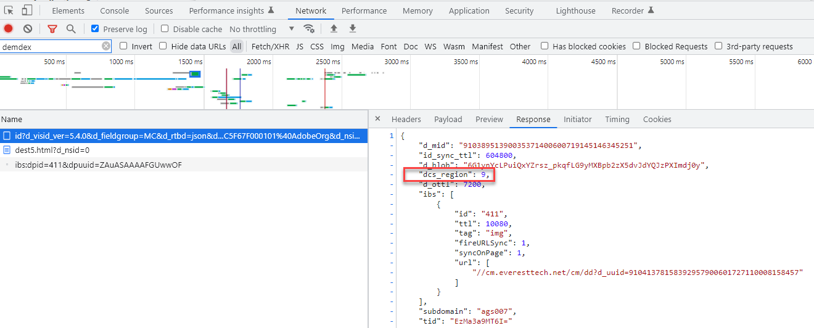
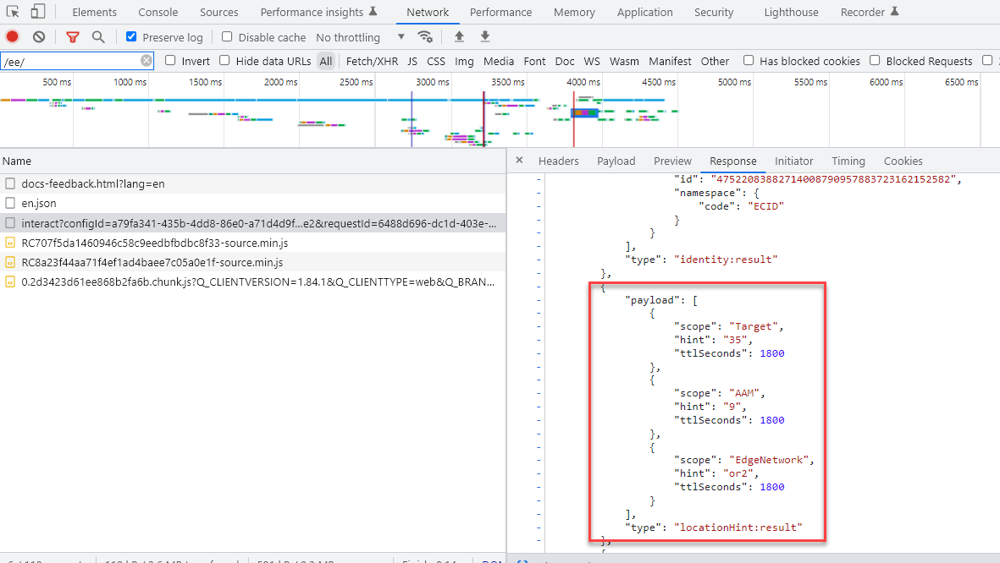
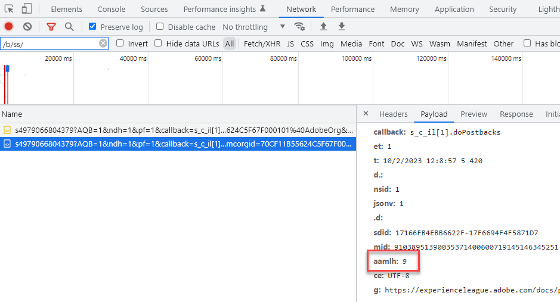
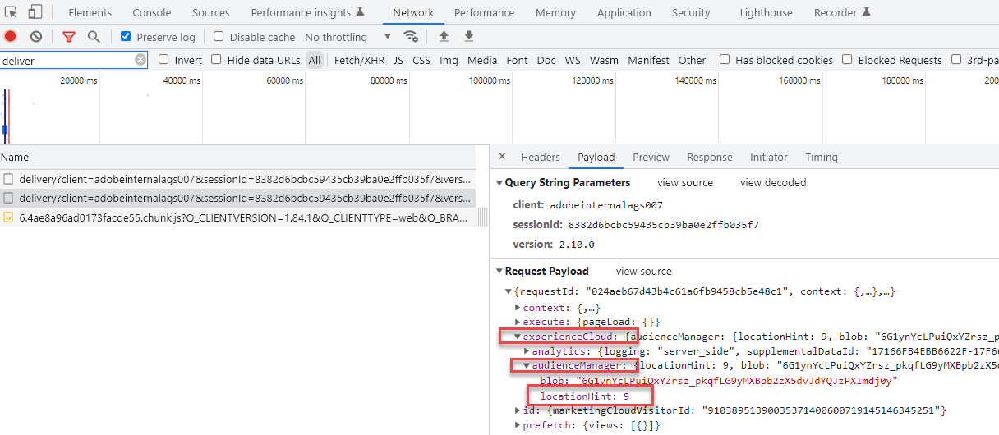
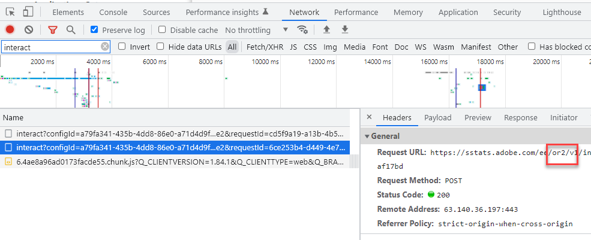

# Standorthinweise, Regionale DCS-Knoten AAM und Standorthinweise zum ID-Dienst

## Beschreibung {#description}

<b>Umgebung</b>
- Experience Platform
- Audience Manager

     <b>Problem/Symptome</b>  Was ist die Beziehung zwischen AEP (Adobe Experience Platform) WebSDK-Standorthinweisen, Experience Cloud-ID-Dienst-Standorthinweisen und AAM regionalen DCS-Knoten und warum ist es wichtig, diese Beziehung zu verstehen? 

## Auflösung {#resolution}

Das AEP WebSDK (das Daten an Experience Edge sendet) und die Echtzeit-Datenerfassung in Adobe Audience Manager (AAM) erfolgt an regionalen Knoten, die weltweit verstreut sind. Es gibt 7 regionale Knoten und AEP WebSDK/Experience Edge und AAM Datenerfassung verwendet dieselben Knoten. AAM Datenerfassungs-Server (DCS) nutzen dieselbe Netzwerkinfrastruktur wie Experience Edge. Da der Experience Cloud-ID-Dienst AAM Technologie verwendet, sind die ID-Dienststandthinweise mit den AAM regionalen Datenerfassungsknoten identisch. Anders ausgedrückt: AAM DCS-Knoten = ID-Dienst-Standorthinweise = Experience Edge-Standorthinweise. AAM regionalen Knoten werden in diesem [Dokumentation](https://experienceleague.adobe.com/docs/audience-manager/user-guide/api-and-sdk-code/dcs/dcs-api-reference/dcs-regions.html?lang=en), während dieselben regionalen Knoten von Experience Edge in dieser [Dokumentation](https://experienceleague.adobe.com/docs/experience-platform/edge-network-server-api/location-hints.html?lang=en).

Obwohl AAM regionalen Knoten und Standorthinweise des ID-Diensts durch Zahlen identifiziert werden und die von Experience Edge durch alphanumerische Zeichen identifiziert werden, werden Sie feststellen, dass sie alle an denselben Bereichen ausgerichtet sind (mit Ausnahme von Brasilien).  Die nachstehende Nachschlagetabelle zeigt, wie sie angeordnet sind:

| Experience Edge-Standorthinweis | Standorthinweis für AAM DCS-Regionsknoten/ID-Dienst |
| --- | --- |
| spg3 | ID: 3 Host: apse.demdex.net |
| irl1 | ID: 6 Host: irl1.demdex.net |
| va6 | ID: 7 Host: use.demdex.net |
| aus3 | ID: 8 Host: apse2.demdex.net |
| or2 | ID: 9 Gastgeber: usw2.demdex.net |
| jpn3 | ID: 11 Gastgeber: tyo3.demdex.net |
| ind1 | ID: 12 Host: ind1.demdex.net |

Die meisten Adobe Experience Cloud-Funktionen, für die Echtzeitantworten erforderlich sind, nutzen diese regionalen Knoten. Der erste Aufruf-ID-Dienst oder Experience Edge-Aufruf auf einer Web-Seite oder mobilen App bestimmt, welcher regionale Knoten verwendet werden soll. Die Standorthinweise finden Sie als Antwort auf diese Aufrufe:

Experience Cloud ID Service:

AEP-Web-SDK:

Sobald der nächstgelegene regionale Knoten für den Endbenutzer ermittelt wurde, wird die Regions-ID in Zukunft über Analytics-, Target- und AEP WebSDK-Aufrufe übergeben. In Analytics wird er als aamlh-Abfragezeichenfolgenparameter übergeben:

In Target wird er im `experienceCloud.audienceManager.locationHint` -Objekt der Anfrage-Payload:

Für das AEP Web SDK wird der Pfad des Aufrufs aktualisiert, um den regionalen Knoten widerzuspiegeln:

<b>Hinweis: </b>Der erste Interaktionsaufruf des AEP WebSDK enthält NICHT die Region im Pfad, da die Region noch nicht bestimmt wurde, der Standorthinweis jedoch in der Antwort enthalten ist (wie oben beschrieben). Der Pfad der ursprünglichen Anfrage lautet einfach ..../ee/v1/... Nachfolgende Aufrufe enthalten jedoch die regionalen Knoteninformationen zwischen den Pfadelementen /ee/ und /v1/ .

Diese Parameter stellen sicher, dass serverseitig weitergeleitete Analytics-Daten an den richtigen AAM Edge-Knoten weitergeleitet werden, dass Target Segmentinformationen von diesem Edge-Knoten anfordert und dass [AEP-Daten senden Daten an AAM](https://experienceleague.adobe.com/docs/audience-manager/user-guide/implementation-integration-guides/integration-experience-platform/aam-aep-audience-sharing.html?lang=de) (und der der Zielgruppenbibliothek) den richtigen regionalen Knoten.

Diese Informationen sind beim Senden von Server- oder Client-seitigen Treffern auf nicht standardmäßige Weise an Adobe-Lösungen wichtig. Beispielsweise muss ein manuell erstellter AEP WebSDK-Aufruf auf einer Seite nur zum Synchronisieren einer ECID (Experience Cloud-ID) mit einem AEP-Profil an den richtigen Experience Edge-Regionalknoten gesendet werden. Ist dies nicht der Fall, werden alle Daten, die von AEP an AAM weitergegeben werden, in die AAM-Backend-Datenbank aufgenommen. Anschließend dauert es zusätzliche 48 Stunden, bis AAM diese Daten an jeden Edge-Knoten übertragen. Dadurch würde sich die Zeit, die Target in der Lage wäre, alle an AAM (oder Zielgruppenbibliothek) gesendeten AEP-Segmente zu verwenden, drastisch verlangsamen. Oder wenn eine serverseitige Analytics-Anforderung an Knoten 7 gesendet wird, die On-Page-Target-Implementierung des Benutzers jedoch Region 9 verwendet, werden die Daten an AAM US-Ostknoten weitergeleitet, während Target den US-Westknoten für Segmentinformationen pingt. Der Endbenutzer kann sich erst dann für Target-Aktivitäten qualifizieren, wenn die Zielgruppen/AAM der Zielgruppenbibliothek 24-48 Stunden später synchronisiert wurden. In Anwendungsfällen wie diesen ist es gängige Praxis, die ECID mit der [getMarketingCloudVisitorID](https://experienceleague.adobe.com/docs/id-service/using/id-service-api/methods/getmcvid.html?lang=en) (ID-Dienst) oder [getIdentity](https://experienceleague.adobe.com/docs/experience-platform/edge/extension/accessing-the-ecid.html?lang=en) (Web SDK)-Funktionen. Zusätzlich zum Abrufen der ECID muss der Standorthinweis jedoch auch abgerufen und verwendet werden, indem die [getLocationHint](https://experienceleague.adobe.com/docs/id-service/using/id-service-api/methods/getlocationhint.html?lang=en) (ID-Dienst) oder durch Abrufen aus der Antwort-Payload von Web SDK-Aufrufen.

