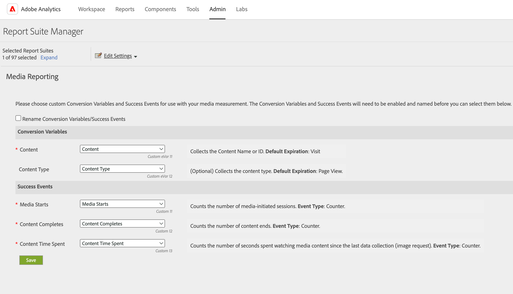

# Benutzer ohne Administratorrechte können keine Daten für bestimmte eVars abrufen

Dieser Artikel bietet einen detaillierten Überblick darüber, warum Benutzer ohne Administratorrechte keine Daten für bestimmte eVars in Adobe Analytics abrufen können. Admin-Benutzer können Dimensionen zuweisen oder die Dimension dem Media Analytics-Arbeitsbereich zuordnen.

## Beschreibung {#description}

### <b>Umgebung</b>

Adobe Analytics

### <b>Problem/Symptome</b>

Benutzern ohne Administratorrechte wird der folgende Fehler angezeigt, ohne dass Daten angezeigt werden, wenn sie versuchen, Daten für bestimmte *eVars* im Adobe Analytics-Arbeitsbereich:

*&quot;Sie haben keinen Zugriff auf die Dimension für diese Anforderung&quot;*

Dies tritt auch dann auf, wenn ihnen ein Produktprofil zugewiesen wurde, das Zugriff auf die spezifischen *eVars* für die jeweilige Report Suite.

## Auflösung {#resolution}

Das Problem tritt auf, wenn die *eVars* werden Dimensionen zugeordnet, die für <b>Media Analytics. </b>

Admin-Benutzer können die Einstellungen auf der <b>Medienberichte</b> Seite. Siehe Abschnitt [Aktivierung von Medienberichten](https://experienceleague.adobe.com/docs/media-analytics/using/media-reports/media-reports-enable.html?lang=en) Dokumentation finden Sie weitere Informationen.

In diesem Fall gibt es zwei Möglichkeiten, dieses Problem zu beheben.

- Administratoren können die für <b>Media Analytics</b>, beispielsweise <b>Inhalt</b> und <b>Content-Typ</b>zum betreffenden Produktprofil.
- Admin-Benutzer können die Zuordnungen der Dimensionen ändern, die für <b>Media Analytics</b> zu verschiedenen Variablen auf der <b>Medienberichte</b> Seite. Sie können beispielsweise die Zuordnung von eVar11 zu einer anderen Variablen, z. B. eVar13, für die Variable <b>Inhalt</b> Dimension im unten stehenden Fall.

