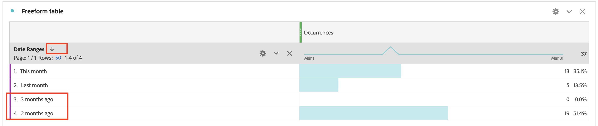

# Wie lässt sich die Reihenfolge der Datumsbereich-Dimension im Workspace-Bericht manuell sortieren?

## Beschreibung {#description}

Problem:
  
 Ich möchte die Dimensionen für den Datumsbereich in der Reihenfolge &quot;Dieser Monat&quot;, &quot;Letzter Monat&quot;, &quot;Vor 2 Monaten&quot;, &quot;Vor 3 Monaten&quot; sortieren.  Durch Klicken auf das Sortiersymbol wird das Symbol jedoch in anderer Reihenfolge angezeigt. Wie kann ich die Reihenfolge der Dimensionen manuell sortieren?  
            

## Auflösung {#resolution}

Mit der Funktion &quot;Tabellenaufbau&quot;können Sie die Dimensionen manuell sortieren.

Öffnen Sie die Freiformtabelle und klicken Sie dann auf die Schaltfläche &quot;Tabellenerstellung aktivieren&quot;

Legen Sie Dimensionen in der gewünschten Reihenfolge ab und klicken Sie auf die Schaltfläche Erstellen .

Jetzt werden die Dimensionen in der Reihenfolge sortiert, in der Sie &quot;Diesen Monat&quot;&quot;Letzten Monat&quot;&quot;Vor 2 Monaten&quot;&quot;Vor 3 Monaten&quot;festgelegt haben

