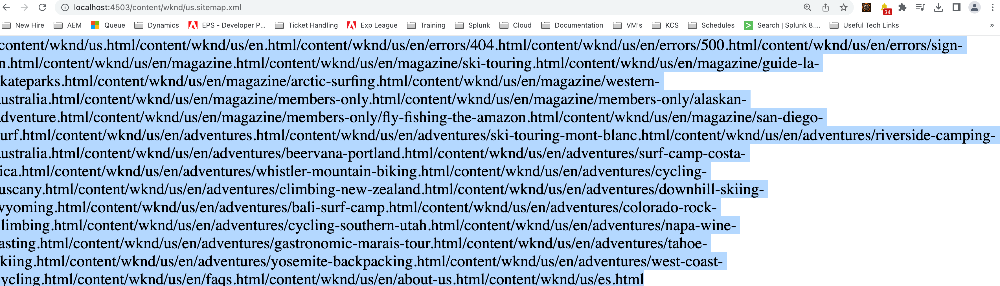

# Sitemap.xml nicht korrekt formatiert

Erfahren Sie mehr über die einfachen Schritte zum Beheben von Adobe AEM Sitemap-Formatierungsproblemen.

## Beschreibung {#description}

### <b>Umgebung</b>

Adobe Experience Manager as a Cloud Service

### <b>Problem/Symptome</b>

Wenn Sie die Sitemap gemäß der Dokumentation mit vordefinierten Einstellungen konfigurieren, wird sie nicht korrekt formatiert (siehe angehängtes Bild als Referenz).

## Auflösung {#resolution}

Bei Verwendung des lokalen SDK:

1. Navigieren Sie zu <b>Konfigurationsmanager</b> ([https://localhost:4502/system/console/configMgr](http://localhost:4502/system/console/configMgr%29 "Folgen Sie dem Link")) und suchen Sie nach <b>Adobe AEM SEO - Seitenstruktur Sitemap Generator</b> (com.adobe.aem.wcm.seo.impl.sitemap.PageTreeSitemapGeneratorImpl).

2. Öffnen Sie die <b>config</b> und deaktivieren <b>Sprachalternativen hinzufügen</b>.

   <b>Hinweis - </b>Wenn diese Option aktiviert ist, werden die Sprachkopien einer Seite hinzugefügt, wenn die Sprache vom URL-Eintrag abweicht<b> </b>(enableLanguageAlternates).

3. Speichern Sie die Einstellungen.

4. Wiederholen Sie den Anwendungsfall.

Legen Sie bei Verwendung einer Cloud-Umgebung (ohne SDK) die oben genannten OSGi-Einstellungen in Ihrem Git-Repository fest und stellen Sie sie über eine Pipeline bereit.
