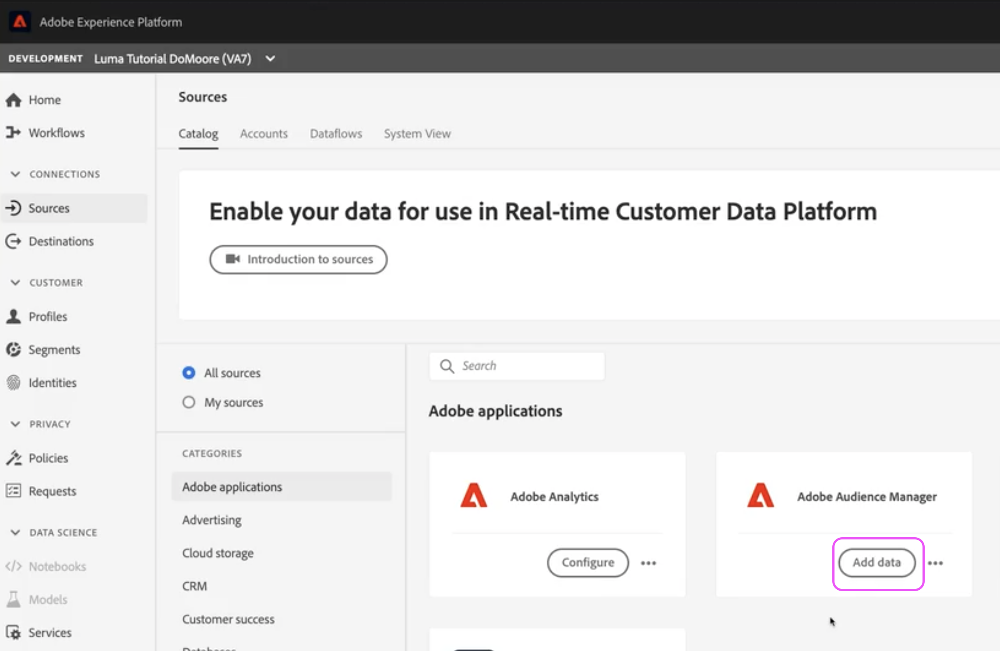
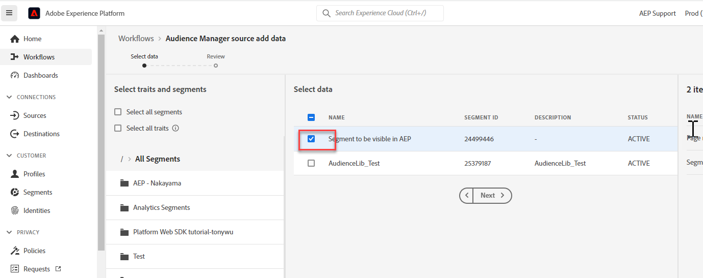

# Aufgrund eines Fehlers bei aktivierter Segmentfreigabe in AAM nicht löschen dürfen

## Beschreibung {#description}

Diese Schritte helfen bei der Behebung des folgenden Fehlers: &quot;Aufgrund der aktivierten Segmentfreigabe nicht löschen darf&quot; 

Dieser Fehler tritt auf, wenn versucht wird, eine Eigenschaft oder ein Segment in AAM zu löschen. Der Grund für diesen Fehler ist, dass die Eigenschaft oder das Segment vom Audience Manager für AEP freigegeben wird.

## Auflösung {#resolution}

Navigieren Sie zunächst in AEP zur Registerkarte Quellen und öffnen Sie die Einstellungen für Ihren Audience Manager-Quell-Connector:

Deaktivieren Sie anschließend die Segmente, die Sie aus AAM löschen möchten:

Sobald die Segmente oder Eigenschaften deaktiviert sind, klicken Sie oben rechts auf Weiter . Überprüfen Sie auf der resultierenden Seite Ihre Änderungen und klicken Sie auf Abgeschlossen .

Wenn Sie alle Segmente und Eigenschaften aus AAM - AEP teilen, müssen Sie Ihre Konfiguration aktualisieren, um bestimmte Segmente freizugeben, oder die Freigabe von Daten beenden, um Ihr AAM Segment zu löschen.

