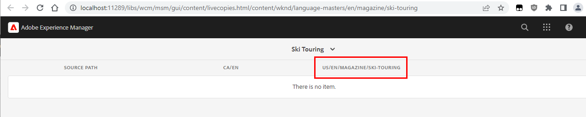

# Verweise werden beim Rollout für die interne Live Copy nicht aktualisiert

## Beschreibung {#description}

<b>Beschreibung</b> :

Wenn einige verschachtelte/innere Live Copies vorhanden sind, werden die Referenzen im Seiteninhalt während des Rollouts nicht auf ihre Live Copy-Entsprechung aktualisiert (sie referenzieren stattdessen den Blueprint-Pfad).

Eine interne Live Copy kann aus mehreren Gründen erstellt werden:

- entweder durch manuelles Erstellen (&quot;Live Copy erstellen&quot;)
- oder durch Bearbeiten der Eigenschaften &quot;Live Copy&quot;einer Unterseite aus einem Live Copy-Stammordner

Betrachtet man beispielsweise die WKND-Beispiel-Website mit der folgenden BluePrint/LiveCopy-Struktur:

- Blueprint : /content/wknd/language-masters/en

- Live Copy : /content/wknd/us/en und /content/wknd/ca/en

Wenn Sie jetzt die Seiteneigenschaften für die Seite &quot;/content/wknd/us/en/magazin/ski-touring&quot;öffnen (Unterseite in der Live Copy &quot;/content/wknd/us/en&quot;).

Wechseln Sie zur Registerkarte &quot;Live Copy&quot;und ändern Sie eine der Eigenschaften (&quot;Live Copy-Vererbung&quot;, &quot;Rollout-Konfigurationen von übergeordneten Elementen übernehmen&quot;, ...), um eine interne Live Copy zu erstellen.

Dies wird durch das Vorhandensein/die Erstellung einer &quot;cq:LiveSyncConfig&quot;unter &quot;/content/wknd/us/en/magazin/ski-touring/jcr:content/cq:LiveSyncConfig&quot;deutlich.

Das Dashboard &quot;Blueprint Live Copy&quot;(navigieren Sie zur Blueprint Live Copy-Übersicht der BP-Seiteneigenschaften) ändert sich ebenfalls von:

in:

## Auflösung {#resolution}

Damit Verweise auf der inneren Live Copy richtig umgeschrieben werden, muss eine bestimmte Konfiguration für die MSM-Aktualisierungsaktion aktiviert werden, um &quot;Verweise über verschachtelte Live Copies hinweg aktualisieren&quot;zu können.

Siehe die entsprechende Dokumentation:

[https://experienceleague.adobe.com/docs/experience-manager-cloud-service/content/sites/administering/reusing-content/msm/live-copy-sync-config.html?lang=en#configuring-synchronization-for-updating-references](https://experienceleague.adobe.com/docs/experience-manager-cloud-service/content/sites/administering/reusing-content/msm/live-copy-sync-config.html?lang=en#configuring-synchronization-for-updating-references)

[https://experienceleague.adobe.com/docs/experience-manager-65/administering/introduction/msm-sync.html?lang=en#configuring-synchronization-for-updating-references](https://experienceleague.adobe.com/docs/experience-manager-65/administering/introduction/msm-sync.html?lang=en#configuring-synchronization-for-updating-references)

Der Vorgang besteht entweder aus der Bereitstellung einer OSGi-Konfigurationsdatei oder der Durchführung der Änderung über die OSGi-Web-Konsole, sofern zutreffend:
1. Zugriff auf die OSGi-Konfiguration der Web-Konsole (http://localhost/system/console/configMgr)
2. Suchen Sie nach &quot;CQ MSM References Update Action (com.day.cq.wcm.msm.impl.actions.ReferencesUpdateActionFactory)&quot;.
3. Aktivieren Sie das Kontrollkästchen &quot;Verweis über verschachtelte Live Copies aktualisieren&quot;
