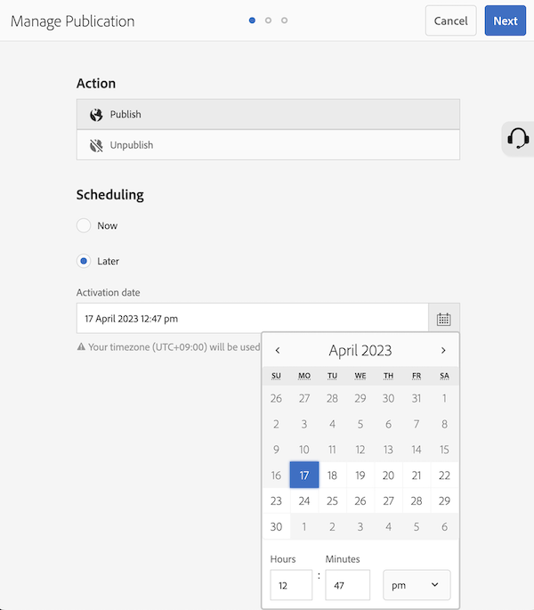

# Adobe Experience Manager: Anpassen des Zeitformats des Aktivierungsdatums für &quot;Veröffentlichung verwalten&quot;

## Beschreibung {#description}

In diesem Artikel wird erläutert, wie Sie das Zeitformat des Aktivierungsdatums für &quot;Veröffentlichung verwalten&quot;anpassen können.      
<b>Umgebungen</b>
AEM 6.5

## Auflösung {#resolution}

Erstellen Sie ein i18n-Wörterbuch für die Zielsprache. Mit den folgenden Schritten wird das Zeitformat für Englisch von 12-Stunden bis 24-Stunden angepasst.

Schritt 1. Erstellen Sie ein benutzerdefiniertes Zeitformat in der Moment.js-Syntax (https://momentjs.com/docs/#/i18n/) 24-Stunden-Format: &quot;2023/04/11 14:24&quot; &quot;JJJ/MM/TT HH:mm&quot;

Schritt 2. Erstellen von Wörterbuchdaten mit CRXDE Lite

- Erstellen Sie einen i18n-Ordner unter dem Projekt (/apps/wknd/i18n)
- Erstellen Sie eine Datei &quot;en.json&quot;im Ordner &quot;i18n&quot;(/apps/wknd/i18n/en.json)
- Fügen Sie dem Dateiknoten die folgenden Eigenschaften hinzu:
   - Name = jcr:mixinTypes, Typ = Name, Wert = mix:language
   - Name = jcr:language, Typ = String, Wert = en
- Dateiinhalt: `{ "D MMMM YYYY hh:mm a" : "YYYY/MM/DD HH:mm" }`

Schritt 3. Rufen Sie den Bildschirm Veröffentlichung verwalten auf, um die Änderung zu überprüfen. Das neue Zeitformat wird möglicherweise nach einem bestimmten Zeitraum aufgrund des Browser-Caches angezeigt

