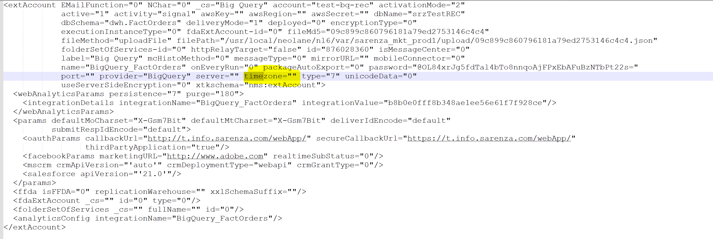

# Fehler: Externes Google BigQuery-Konto XSV-350064

## Beschreibung {#description}

<b>Umgebung</b> Campaign Classic v7   <b>Problem/Symptome</b> Beim Versuch, das externe Konto für <b>Google BigQuery</b> Externe Datenbank: Wenn wir auf Testverbindung klicken, erhalten wir die folgenden Fehler:
  XSV-350064 - Für den Zugriff auf Remote-Datenbanken müssen Sie die Zeitzone der Daten angeben XSV-350062 - Datenquelle kann nicht gestartet werden    
<b>Gehen Sie wie folgt vor:</b>

- Wechseln Sie zu den externen Konten.
- Klicken Sie auf <b>Typ erstellen und auswählen</b> und wählen Sie <b>Big Query Google</b> und füllen Sie alle anderen Details aus.
- Klicken Sie auf <b>Verbindung testen</b> und dann wird ein Fehler angezeigt.

## Auflösung {#resolution}

So setzen Sie den Wert für das Feld zurück `timezone`, müssen Sie den Typ in <b>PostgreSQL</b> (das *timezone* -Feld in der Benutzeroberfläche). Hier können Sie einen Wert auswählen und dann das externe Konto speichern.

Ändern Sie anschließend den Typ in <b>Google Big Query </b>erneut verwenden und alte Daten ersetzen und die <b>XML-Datei bearbeiten</b> (dieser sollte jetzt einen Wert für *timezone*).

Testen Sie außerdem die Verbindung erneut und stellen Sie sicher, dass keine Fehler mehr in Bezug auf die Zeitzone auftreten.

<b>Ursache:</b>
Nach Überprüfung der XML-Datei bearbeiten konnten wir sehen, dass kein Wert für *timezone* field (`timezone=""`)

