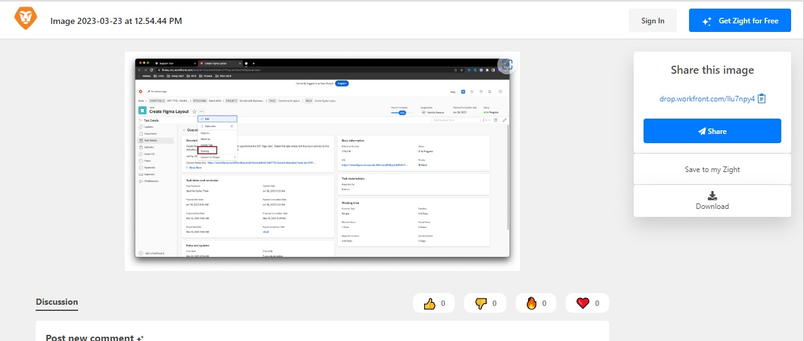

# Benutzerdefinierte Felder können nicht bearbeitet werden | Workfront

## Beschreibung {#description}

<b>Umgebung</b>  Workfront     <b>Problem/Symptome</b>
Es gibt verschiedene Szenarien, in denen ein Benutzer Probleme bei der Bearbeitung benutzerdefinierter Felder haben kann. Beispielsweise beim Senden einer Anforderung, beim Anzeigen eines benutzerdefinierten Formulars auf einem Objekt oder beim Anzeigen von benutzerdefinierten Feldern in einem Bericht.

## Auflösung {#resolution}

<b>Schritt zur Auflösung:</b>
1. Vergewissern Sie sich, dass das Formular, das das Feld enthält, an das Objekt angehängt ist. Bei der Bearbeitung wird versucht
   1. Wenn ein Benutzer ohne Administratorrechte ein Formular an das Objekt anhängen möchte, muss er den Zugriff auf das Objekt verwalten, um das Formular anhängen zu können.
2. Überprüfen Sie, ob alle Details in der Formularfreigabe korrekt sind.
   1. Öffnen Sie die <b>Freigabe</b> Einstellungen für das Objekt, an das das Formular angehängt ist, siehe unten:
   2. Suchen Sie nach dem betroffenen Benutzer auf der <b>Freigabe</b>Menü
      - Wenn der Benutzer nicht aufgeführt ist, fügen Sie ihn der Freigabe hinzu.
   3. Stellen Sie sicher, dass der Benutzer über die <b>Beitragen</b> Berechtigung mit <b>Benutzerdefiniertes Formular bearbeiten</b> aktiviert in <b>Erweiterte Einstellungen, </b>siehe unten:
   4. <b>(Dieser Schritt ist optional.) </b>Wenn dieses Formular Teil eines<b> Anforderungswarteschlange, </b>Überprüfen Sie die Freigabeeinstellungen auf der<b> Anforderungswarteschlange </b>auch benutzerdefinierte Formulare. Siehe unten:

Weitere Informationen finden Sie unter den folgenden Links:

- [Informationen in benutzerdefinierten Formularfeldern bearbeiten](https://experienceleague.adobe.com/docs/workfront/using/basics/work-with-custom-forms/edit-custom-forms.html?lang=en)
- [Erstellen einer Anforderungswarteschlange](https://experienceleague.adobe.com/docs/workfront/using/manage-work/requests/create-and-manage-request-queues/create-request-queue.html?lang=en)

