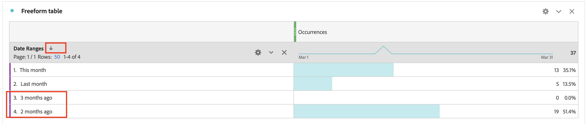
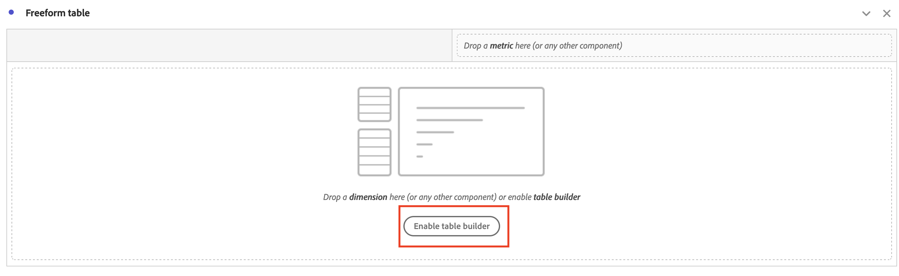
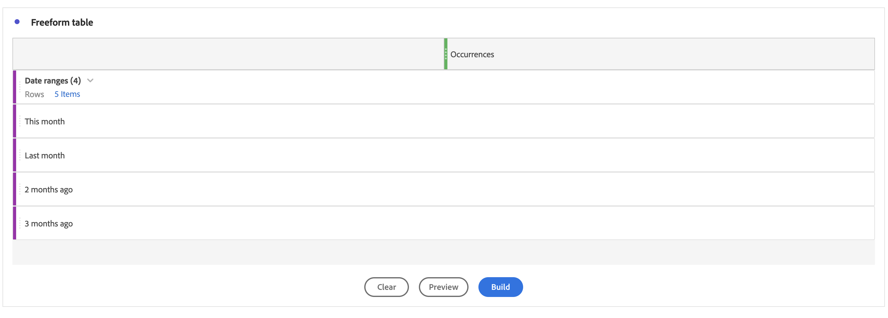
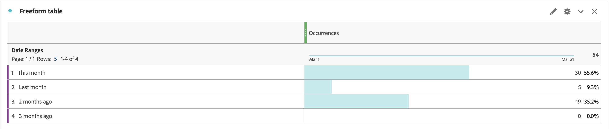

# Wie lässt sich die Reihenfolge der Datumsbereich-Dimension im Workspace-Bericht manuell sortieren?

Wenn die Sortierung des Datumsbereichs nicht dazu beiträgt, die Reihenfolge der Dimensionen in Adobe Analytics zu sortieren, verwenden Sie die Funktion &quot;Tabellenaufbau&quot;. Dieser Artikel hilft Ihnen, dieses Problem zu beheben.

## Beschreibung {#description}

### <b>Umgebung</b>

Adobe Analytics

### <b>Problem/Symptome:</b>

Wenn jemand die <b>Dimensionen für Datumsbereiche</b> in der Reihenfolge *Diesen Monat* next *Letzter Monat*  next *Vor 2 Monaten* next *vor 3 Monaten,* aber durch Klicken auf das Sortiersymbol wird es in anderer Reihenfolge angezeigt.
Wie kann jemand die Reihenfolge der Dimensionen manuell sortieren?

             

## Auflösung {#resolution}

<b>Lösung:</b>
Sie können die Dimensionen manuell mit der <b>Tabellenaufbau</b> Funktion.

1. Öffnen Sie die Freiformtabelle und klicken Sie dann auf <b>Tabellenerstellung aktivieren</b> button 
2. Legen Sie Dimensionen in der gewünschten Reihenfolge ab und klicken Sie auf die Schaltfläche <b>Build</b> button
3. Jetzt werden die Dimensionen in der von Ihnen festgelegten Reihenfolge (*Diesen Monat* next  *Letzter Monat*  next *Vor 2 Monaten*  next *Vor 3 Monaten*)

