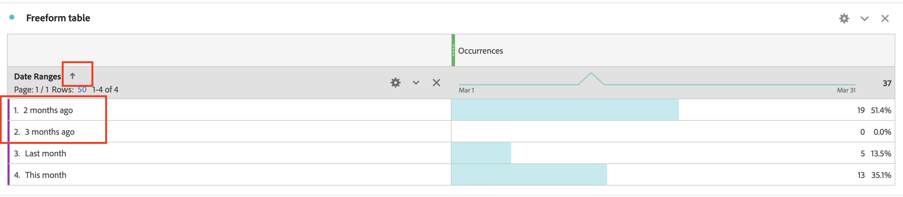

# Wie lässt sich die Reihenfolge der Datumsbereich-Dimension im Workspace-Bericht manuell sortieren?

## Beschreibung {#description}

 Problem:
  
 Ich möchte die Datumsbereich-Dimensionen in der Reihenfolge &quot;Diesen Monat&quot;im nächsten &quot;letzten Monat&quot;nach &quot;Vor zwei Monaten&quot;sortieren, aber durch Klicken auf das Sortierungssymbol wird es in anderer Reihenfolge angezeigt. Wie kann ich die Reihenfolge der Dimensionen manuell sortieren?  
             

## Auflösung {#resolution}

Mit der Funktion &quot;Tabellenaufbau&quot;können Sie die Dimensionen manuell sortieren.

1. Öffnen Sie die Freiformtabelle und klicken Sie dann auf die Schaltfläche &quot;Tabellenerstellung aktivieren&quot; 
2. Legen Sie Dimensionen in der gewünschten Reihenfolge ab und klicken Sie auf die Schaltfläche Erstellen .
3. Jetzt werden die Dimensionen in der von Ihnen festgelegten Reihenfolge sortiert (&quot;Dieser Monat&quot;im nächsten &quot;letzten Monat&quot;vor 2 Monaten &quot;Vor 3 Monaten&quot;)

