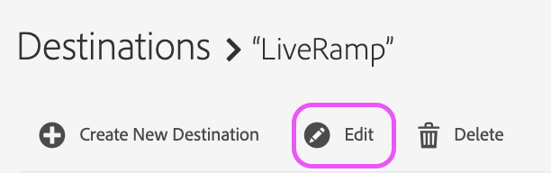
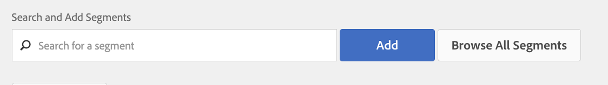
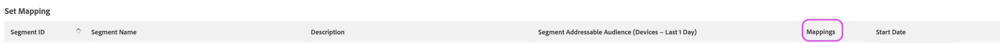

# LiveRamp Server-zu-Server-Ziel

## Beschreibung {#description}

<b>Umgebung</b>

Adobe Audience Manager

<b>Problem/Symptome</b>

Dieser Artikel bietet einen Überblick über das LiveRamp-Ziel in Audience Manager.

<b>Lernziele</b>

- &#x200B; &#x200B; &#x200B; &#x200B; &#x200B; LiveRamp-Ziel-Setup-Prozess
- Segmentaktivierungsprozess

## Auflösung {#resolution}

<b>Einrichten des LiveRamp-Ziels</b>

Wenn Sie bereits über ein vorhandenes LiveRamp-Ziel verfügen, fahren Sie mit dem Abschnitt zur Segmentaktivierung fort. 

Das LiveRamp-Ziel ist ein [Server-zu-Server-Integration](https://experienceleague.adobe.com/docs/audience-manager/user-guide/features/destinations/device-based/device-based-destinations-list.html?lang=de), was bedeutet, dass die Konfiguration im Backend erfolgt. Zum ersten Mal benötigen Sie die Unterstützung des Audience Manager-Kundenbetreuungsteams. Öffnen Sie eine Anfrage über das [Admin Console](https://adminconsole.adobe.com/) Anforderung der Erstellung eines LiveRamp-Ziels. Stellen Sie sicher, dass Sie diese wichtigen Details einschließen:

- Zielname und Beschreibung
- LiveRamp-Client-Name (alphanumerischer Wert, bereitgestellt von LR-Vertreter)
- Segmentzuordnungsvoreinstellung: manuelle ID vs. automatische Ausfüllungs-ID

Die Option für die Segmentzuordnung wirkt sich auf die Versandmethode für die LiveRamp-Plattform aus. Weitere Informationen finden Sie im Abschnitt zur Segmentaktivierung .

<b>Segmentaktivierungsprozess</b>

Nachdem das Kundenunterstützungsteam das Ziel erstellt hat, können bestimmte Zielgruppen/Segmente direkt über die Benutzeroberfläche für das LiveRamp-Ziel aktiviert werden. Navigieren Sie zunächst zum Ziel und wählen Sie Bearbeiten aus:

Sie können die Segmente, die Sie zuordnen möchten, jetzt über diesen Bildschirm identifizieren und hinzufügen:

Der Zuordnungswert bestimmt, wie LiveRamp die Zielgruppen innerhalb ihrer Plattform repräsentiert: 

Wenn Sie Ihr Ziel mit der automatischen Füllung konfigurieren (die Standardoption), werden die Segment-IDs automatisch in das Zuordnungsfeld eingefügt. Das bedeutet, dass all Ihre Segmente nach ID in der LiveRamp-Plattform organisiert werden.

Wenn Sie Segmente manuell zuordnen möchten, können Sie beim Festlegen des Zuordnungswerts Ihre eigenen Anzeigenamen oder IDs für die Segmente auswählen. Der Nachteil besteht darin, dass diese Werte jedes Mal, wenn Sie ein Segment zuordnen, manuell eingegeben werden müssen. Aus diesem Grund beinhaltet die standardmäßige und bevorzugte Methode die automatische Zuordnung von Segment-IDs. Wenn Sie Fragen zu diesem Vorgang haben, öffnen Sie bitte eine Anfrage an den Audience Manager-Kundendienst, damit wir Ihnen weiterhelfen können.
