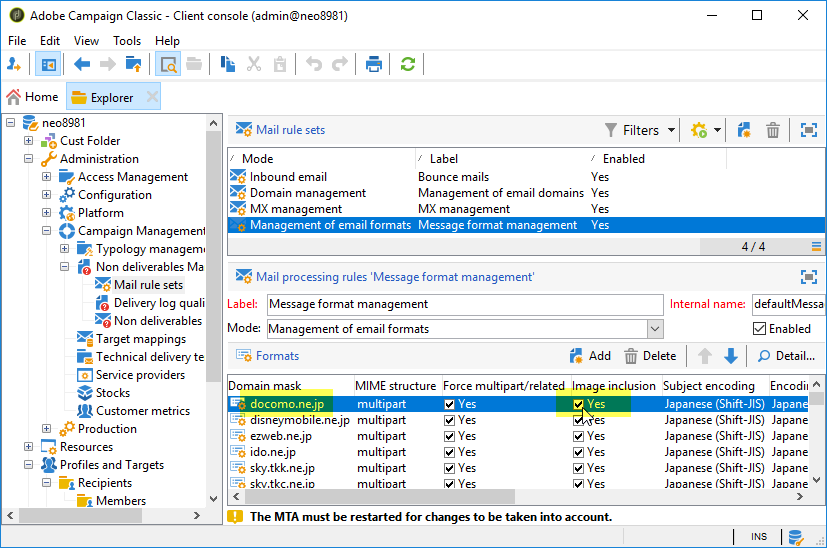
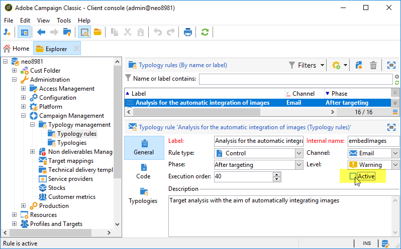

# Wie lässt sich eine langsame E-Mail-Zustellung aufgrund von Deco-Mail-Empfängern verhindern?

## Beschreibung {#description}

<b>Umgebung</b>

- Adobe Campaign Classic (ACC)

- Adobe Campaign Standard (ACS)

<b>Problem/Symptome</b>

Ein E-Mail-Kanal-Versand kann sehr langsam sein, wenn die Zielpopulation Empfänger mit der <b>Deco-mail</b> E-Mail-Formate.

Ein Empfänger hat <b>Deco-mail</b> E-Mail-Format unter einem oder beiden der folgenden Fälle:

1. Das E-Mail-Format ist explizit auf einen der folgenden Werte eingestellt:
   - Deco-mail (DoCoMo)
   - Decoration Mail (KDDI AU)
   - Decore Mail (Softbank)         
2. Die E-Mail-Domain ist wie folgt konfiguriert: `Image inclusion=yes`in:
   - <b>Campaign Management</b> › <b>Verwaltung von Fehlern</b> › <b>Verwaltung von Nachrichtenformaten</b>        

## Auflösung {#resolution}

Um diesen langsamen Versand zu verhindern, versuchen Sie Folgendes:

- Bereinigen Sie die Zielpopulation so, dass sie keinen Deco-mail-Empfänger enthält.
- Gestalten Sie den entsprechenden Workflow so, dass Deco-mail-Empfänger aus der Zielpopulation ausgeschlossen werden.
- Ausschalten <b>Analyse für die automatische Integration von Bildern</b>.    

<b>Ursache</b>

Wenn der Empfänger das E-Mail-Format Deco-mail hat, wendet Campaign die Typologieregel an - <b>Analyse für die automatische Integration von Bildern</b>. Dadurch werden Bildlinks in der E-Mail an den Deco-Mail-Empfänger in Bilddateien für Anhänge umgewandelt. Die Gesamtversandgröße könnte sehr groß werden und der Durchsatz könnte sich erheblich verlangsamen.
