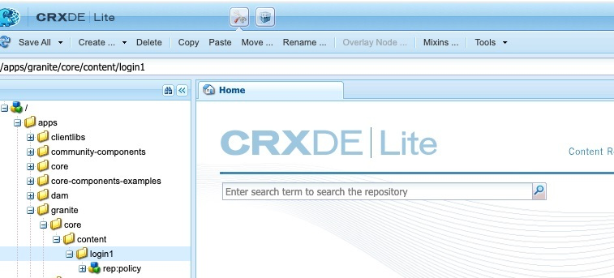
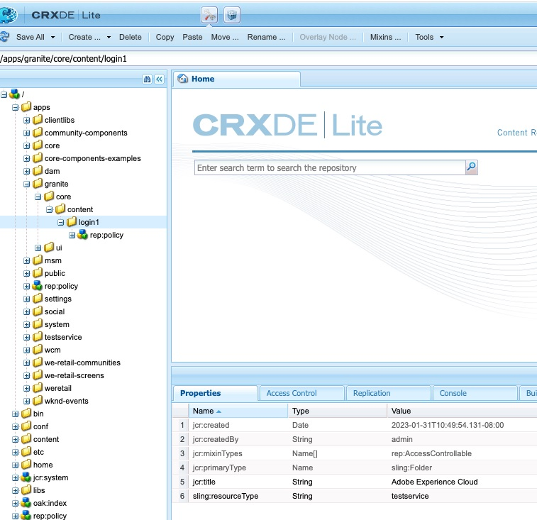
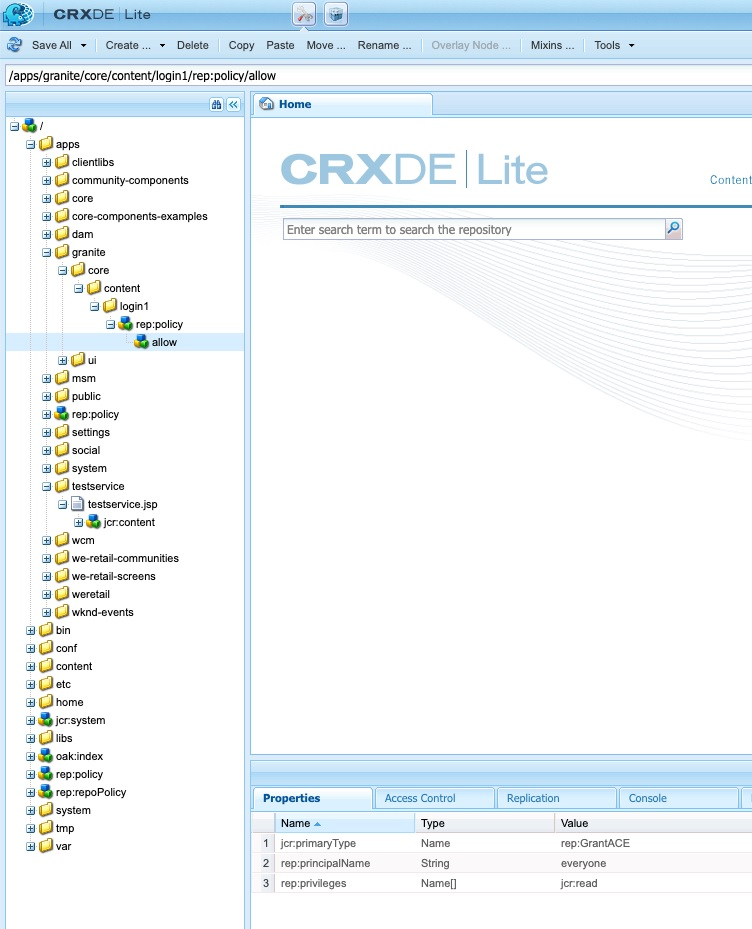
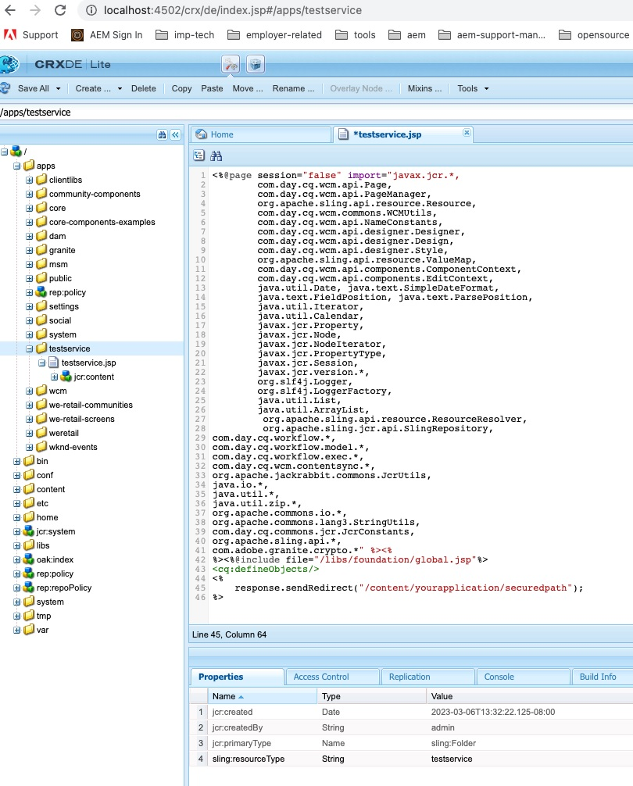
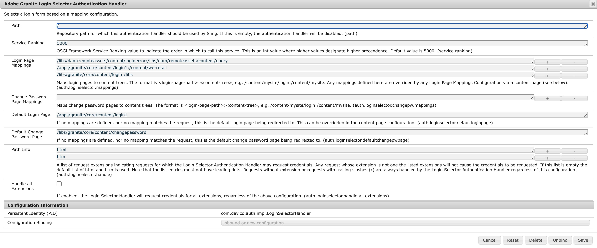
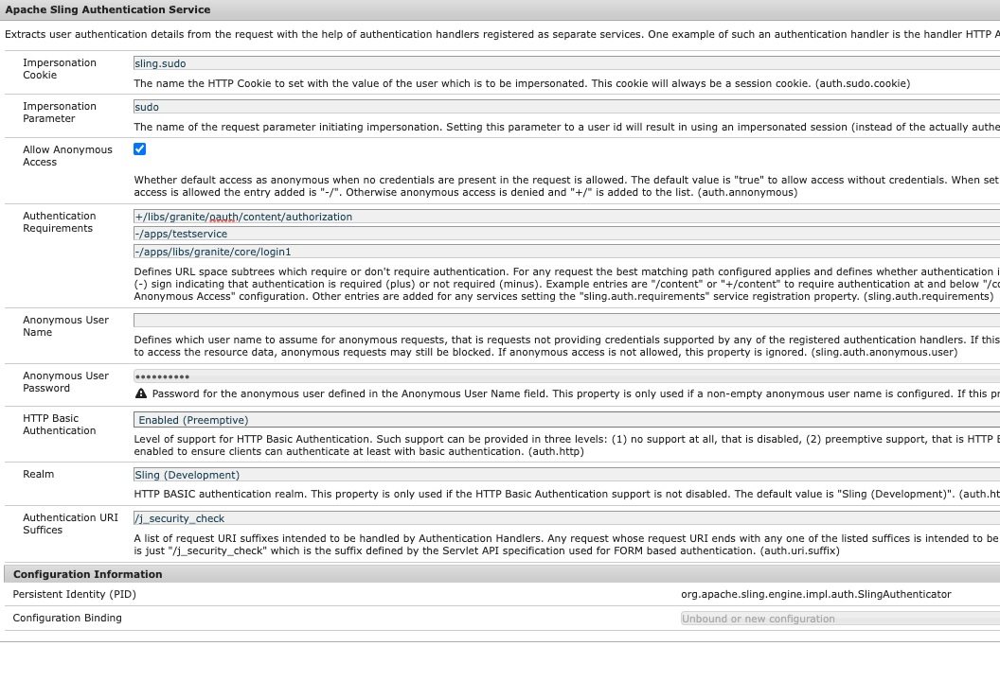

# Weiterleitung zur benutzerdefinierten Anmeldeseite bei fehlgeschlagenem OAuth-AEM

Erfahren Sie, wie Sie die Benutzer bei einem OAuth-Flow-Fehler zur benutzerdefinierten Anmeldeseite umleiten, indem Sie sie zur benutzerdefinierten Anmeldeseite umleiten.

## Beschreibung {#description}

### <b>Umgebung</b>

Experience Manager

### <b>Problem/Symptome</b>

Wie kann ich in einer Adobe Experience Manager-Veröffentlichungsumgebung (AEM) zur benutzerdefinierten Anmeldeseite umleiten, wenn AEM Open Authorization (OAuth)-Fluss fehlschlägt?

## Auflösung {#resolution}

Im Fall von &quot;Security Assertion Markup Language&quot;(SAML)/OAuth-Fluss leitet das System bei einem Fehler im AEM Authentifizierungsfluss zur standardmäßigen Out-of-the-Box (OOTB)-AEM Anmeldeseite um.

Daher müssen die Benutzer auf die benutzerdefinierte SAML-/OAuth-IDP-Anmeldeseite umgeleitet werden. Gehen Sie wie folgt vor:

1. Kopieren Sie diesen Knotenpfad */libs/granite/core/content/login* nach */apps/granite/core/content/login1* wie unten beschrieben.
2. Ändern des Ressourcentyps von */apps/granite/core/content/login1* nach <b>testservice</b>, wie unten dargestellt:
3. Erstellen Sie eine `rep:policy` Knoten unter login1 mit <b>allow child</b>, wie unten dargestellt:
4. Erstellen Sie eine <b>testservice</b> Ordner unter <b>/apps</b> und hinzufügen <b>sling:resourceType</b> mit <b>testservice</b> und erstellen Sie eine JSP-Datei mit dem Namen <b>testservice.jsp</b>, wie unten gezeigt: (Hinweis: Bei OAuth-Fluss müssen Sie sicherstellen, dass Sie anhängen */j_security_check?configure=`<` entsprechende oauth-Konfiguration`>`* zum gesicherten Umleitungspfad im <b>JSP</b> unten)
5. Öffnen Sie die OSGI-Konfiguration <b>Adobe Granite Login Selector Authentication Handler</b> und ändern Sie die Standardanmeldeseite in */apps/granite/core/content/login1* und passen Sie die `auth.loginselector.mappings` -Eigenschaft auf meine überlagerte Anmeldeseite für Ihren gesicherten Pfad verweisen. Siehe unten:
6. Öffnen Sie die OSGI-Konfiguration <b>Apache Sling-Authentifizierungsdienst</b> und hinzufügen *-/apps/granite/core/content/login1* und *-/apps/testservice* der `sling.auth.requirements` Liste. Siehe unten:

